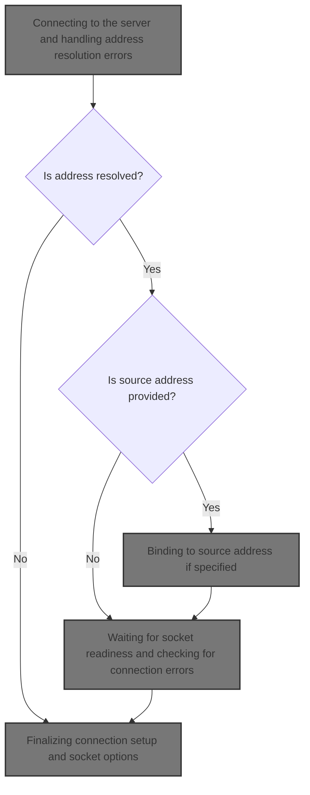
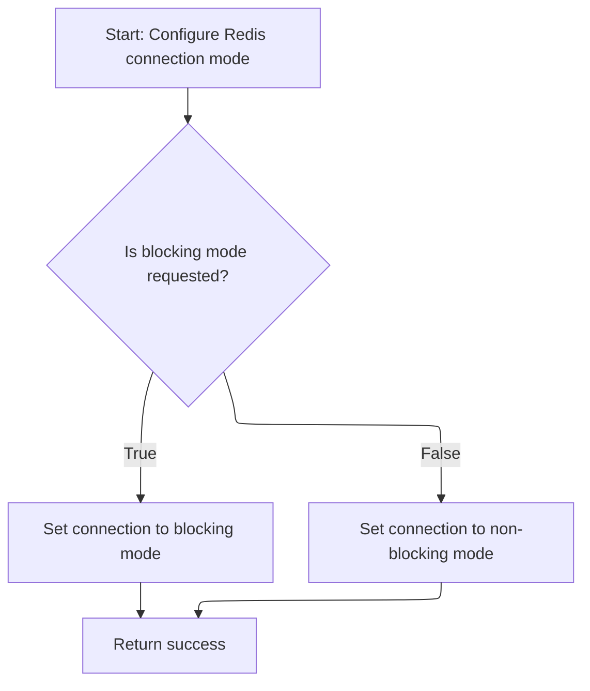
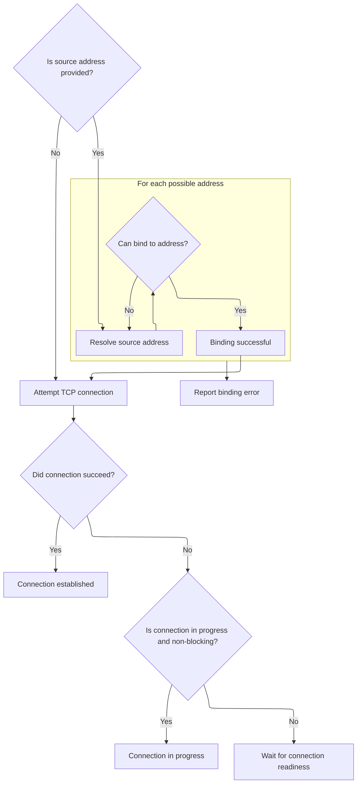
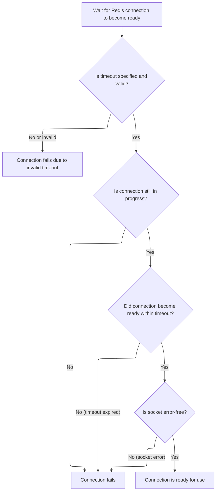
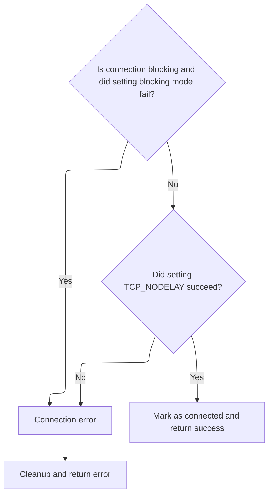

This document describes how a client connects to a Redis server over TCP, using provided connection parameters and optionally binding to a specific source address. The flow ensures the connection is established and ready for use by resolving the server address, configuring the socket, waiting for readiness, and finalizing connection options.



# Where is this flow used?

This flow is used multiple times in the codebase as represented in the following diagram:

```mermaid
graph TD;
      71e4bfa6b8602835d8e082c30e90cccc8480ee160fd5acf521954f306f31c560(deps/hiredis/net.c::redisContextConnectTcp) --> 210b01b0a7a5f3c8f0a943ae00435c2f4c49ea3fa48e83b2b7cc576e410b5ed7(deps/hiredis/net.c::_redisContextConnectTcp):::mainFlowStyle

792d6bcec63e2337d903edf9ad2345b75583655fb1d606fac761a302fbe1c507(deps/hiredis/net.c::redisContextConnectBindTcp) --> 210b01b0a7a5f3c8f0a943ae00435c2f4c49ea3fa48e83b2b7cc576e410b5ed7(deps/hiredis/net.c::_redisContextConnectTcp):::mainFlowStyle


classDef mainFlowStyle color:#000000,fill:#7CB9F4
classDef rootsStyle color:#000000,fill:#00FFF4
classDef Style1 color:#000000,fill:#00FFAA
classDef Style2 color:#000000,fill:#FFFF00
classDef Style3 color:#000000,fill:#AA7CB9

%% Swimm:
%% graph TD;
%%       71e4bfa6b8602835d8e082c30e90cccc8480ee160fd5acf521954f306f31c560(<SwmPath>[deps/hiredis/net.c](deps/hiredis/net.c)</SwmPath>::<SwmToken path="deps/hiredis/net.c" pos="345:2:2" line-data="int redisContextConnectTcp(redisContext *c, const char *addr, int port,">`redisContextConnectTcp`</SwmToken>) --> 210b01b0a7a5f3c8f0a943ae00435c2f4c49ea3fa48e83b2b7cc576e410b5ed7(<SwmPath>[deps/hiredis/net.c](deps/hiredis/net.c)</SwmPath>::<SwmToken path="deps/hiredis/net.c" pos="256:4:4" line-data="static int _redisContextConnectTcp(redisContext *c, const char *addr, int port,">`_redisContextConnectTcp`</SwmToken>):::mainFlowStyle
%% 
%% 792d6bcec63e2337d903edf9ad2345b75583655fb1d606fac761a302fbe1c507(<SwmPath>[deps/hiredis/net.c](deps/hiredis/net.c)</SwmPath>::<SwmToken path="deps/hiredis/net.c" pos="350:2:2" line-data="int redisContextConnectBindTcp(redisContext *c, const char *addr, int port,">`redisContextConnectBindTcp`</SwmToken>) --> 210b01b0a7a5f3c8f0a943ae00435c2f4c49ea3fa48e83b2b7cc576e410b5ed7(<SwmPath>[deps/hiredis/net.c](deps/hiredis/net.c)</SwmPath>::<SwmToken path="deps/hiredis/net.c" pos="256:4:4" line-data="static int _redisContextConnectTcp(redisContext *c, const char *addr, int port,">`_redisContextConnectTcp`</SwmToken>):::mainFlowStyle
%% 
%% 
%% classDef mainFlowStyle color:#000000,fill:#7CB9F4
%% classDef rootsStyle color:#000000,fill:#00FFF4
%% classDef Style1 color:#000000,fill:#00FFAA
%% classDef Style2 color:#000000,fill:#FFFF00
%% classDef Style3 color:#000000,fill:#AA7CB9
```



# Connecting to the server and handling address resolution errors

```mermaid
%%{init: {"flowchart": {"defaultRenderer": "elk"}} }%%
flowchart TD
    node1["Resolve server address (IPv4, fallback to IPv6)"] --> node2{"Is address resolved?"}
    click node1 openCode "deps/hiredis/net.c:256:280"
    node2 -->|"Yes"| node3["Try connecting to server addresses"]
    node2 -->|"No"| node5["Return error"]
    click node2 openCode "deps/hiredis/net.c:274:280"
    subgraph loop1["For each possible server address"]
        node3 --> node6{"Is source address provided?"}
        click node3 openCode "deps/hiredis/net.c:281:322"
        node6 -->|"Yes"| node7["Bind to source address"]
        node6 -->|"No"| node8["Skip binding"]
        click node6 openCode "deps/hiredis/net.c:288:310"
        node7 --> node9["Configuring socket blocking mode and error reporting"]
        node8 --> node9
        click node7 openCode "deps/hiredis/net.c:288:310"
        click node8 openCode "deps/hiredis/net.c:311:321"
        node9 --> node10{"Is connection successful or needs readiness wait?"}
        
        node10 -->|"Ready"| node11["Configuring socket blocking mode and error reporting"]
        node10 -->|"Not ready"| node12["Waiting for socket readiness and checking for connection errors"]
        click node10 openCode "deps/hiredis/net.c:311:321"
        node12 --> node11
        
        node11 --> node13["Finalize connection and set options"]
        
        node13 --> node5["Return connection result"]
        click node13 openCode "deps/hiredis/net.c:322:329"
    end
    click node5 openCode "deps/hiredis/net.c:338:343"
classDef HeadingStyle fill:#777777,stroke:#333,stroke-width:2px;
click node9 goToHeading "Configuring socket blocking mode and error reporting"
node9:::HeadingStyle
click node11 goToHeading "Configuring socket blocking mode and error reporting"
node11:::HeadingStyle
click node12 goToHeading "Waiting for socket readiness and checking for connection errors"
node12:::HeadingStyle

%% Swimm:
%% %%{init: {"flowchart": {"defaultRenderer": "elk"}} }%%
%% flowchart TD
%%     node1["Resolve server address (<SwmToken path="deps/hiredis/net.c" pos="269:13:13" line-data="    /* Try with IPv6 if no IPv4 address was found. We do it in this order since">`IPv4`</SwmToken>, fallback to <SwmToken path="deps/hiredis/net.c" pos="269:7:7" line-data="    /* Try with IPv6 if no IPv4 address was found. We do it in this order since">`IPv6`</SwmToken>)"] --> node2{"Is address resolved?"}
%%     click node1 openCode "<SwmPath>[deps/hiredis/net.c](deps/hiredis/net.c)</SwmPath>:256:280"
%%     node2 -->|"Yes"| node3["Try connecting to server addresses"]
%%     node2 -->|"No"| node5["Return error"]
%%     click node2 openCode "<SwmPath>[deps/hiredis/net.c](deps/hiredis/net.c)</SwmPath>:274:280"
%%     subgraph loop1["For each possible server address"]
%%         node3 --> node6{"Is source address provided?"}
%%         click node3 openCode "<SwmPath>[deps/hiredis/net.c](deps/hiredis/net.c)</SwmPath>:281:322"
%%         node6 -->|"Yes"| node7["Bind to source address"]
%%         node6 -->|"No"| node8["Skip binding"]
%%         click node6 openCode "<SwmPath>[deps/hiredis/net.c](deps/hiredis/net.c)</SwmPath>:288:310"
%%         node7 --> node9["Configuring socket blocking mode and error reporting"]
%%         node8 --> node9
%%         click node7 openCode "<SwmPath>[deps/hiredis/net.c](deps/hiredis/net.c)</SwmPath>:288:310"
%%         click node8 openCode "<SwmPath>[deps/hiredis/net.c](deps/hiredis/net.c)</SwmPath>:311:321"
%%         node9 --> node10{"Is connection successful or needs readiness wait?"}
%%         
%%         node10 -->|"Ready"| node11["Configuring socket blocking mode and error reporting"]
%%         node10 -->|"Not ready"| node12["Waiting for socket readiness and checking for connection errors"]
%%         click node10 openCode "<SwmPath>[deps/hiredis/net.c](deps/hiredis/net.c)</SwmPath>:311:321"
%%         node12 --> node11
%%         
%%         node11 --> node13["Finalize connection and set options"]
%%         
%%         node13 --> node5["Return connection result"]
%%         click node13 openCode "<SwmPath>[deps/hiredis/net.c](deps/hiredis/net.c)</SwmPath>:322:329"
%%     end
%%     click node5 openCode "<SwmPath>[deps/hiredis/net.c](deps/hiredis/net.c)</SwmPath>:338:343"
%% classDef HeadingStyle fill:#777777,stroke:#333,stroke-width:2px;
%% click node9 goToHeading "Configuring socket blocking mode and error reporting"
%% node9:::HeadingStyle
%% click node11 goToHeading "Configuring socket blocking mode and error reporting"
%% node11:::HeadingStyle
%% click node12 goToHeading "Waiting for socket readiness and checking for connection errors"
%% node12:::HeadingStyle
```



<SwmSnippet path="/deps/hiredis/net.c" line="256">

---

In <SwmToken path="deps/hiredis/net.c" pos="256:4:4" line-data="static int _redisContextConnectTcp(redisContext *c, const char *addr, int port,">`_redisContextConnectTcp`</SwmToken> we kick off the connection by resolving the server address using getaddrinfo, first with <SwmToken path="deps/hiredis/net.c" pos="269:13:13" line-data="    /* Try with IPv6 if no IPv4 address was found. We do it in this order since">`IPv4`</SwmToken>, then fallback to <SwmToken path="deps/hiredis/net.c" pos="269:7:7" line-data="    /* Try with IPv6 if no IPv4 address was found. We do it in this order since">`IPv6`</SwmToken> if needed. If both fail, we call <SwmToken path="deps/hiredis/net.c" pos="277:1:1" line-data="            __redisSetError(c,REDIS_ERR_OTHER,gai_strerror(rv));">`__redisSetError`</SwmToken> to record the error and bail out. Next, we need to jump to <SwmPath>[deps/hiredis/hiredis.c](deps/hiredis/hiredis.c)</SwmPath> to actually set the error details in the context, so the caller knows what went wrong.

```c
static int _redisContextConnectTcp(redisContext *c, const char *addr, int port,
                                   const struct timeval *timeout,
                                   const char *source_addr) {
    int s, rv;
    char _port[6];  /* strlen("65535"); */
    struct addrinfo hints, *servinfo, *bservinfo, *p, *b;
    int blocking = (c->flags & REDIS_BLOCK);

    snprintf(_port, 6, "%d", port);
    memset(&hints,0,sizeof(hints));
    hints.ai_family = AF_INET;
    hints.ai_socktype = SOCK_STREAM;

    /* Try with IPv6 if no IPv4 address was found. We do it in this order since
     * in a Redis client you can't afford to test if you have IPv6 connectivity
     * as this would add latency to every connect. Otherwise a more sensible
     * route could be: Use IPv6 if both addresses are available and there is IPv6
     * connectivity. */
    if ((rv = getaddrinfo(addr,_port,&hints,&servinfo)) != 0) {
         hints.ai_family = AF_INET6;
         if ((rv = getaddrinfo(addr,_port,&hints,&servinfo)) != 0) {
            __redisSetError(c,REDIS_ERR_OTHER,gai_strerror(rv));
            return REDIS_ERR;
        }
    }
```

---

</SwmSnippet>

<SwmSnippet path="/deps/hiredis/hiredis.c" line="973">

---

<SwmToken path="deps/hiredis/hiredis.c" pos="973:2:2" line-data="void __redisSetError(redisContext *c, int type, const char *str) {">`__redisSetError`</SwmToken> updates the context with the error type and message, using a provided string or the system error if it's an I/O error.

```c
void __redisSetError(redisContext *c, int type, const char *str) {
    size_t len;

    c->err = type;
    if (str != NULL) {
        len = strlen(str);
        len = len < (sizeof(c->errstr)-1) ? len : (sizeof(c->errstr)-1);
        memcpy(c->errstr,str,len);
        c->errstr[len] = '\0';
    } else {
        /* Only REDIS_ERR_IO may lack a description! */
        assert(type == REDIS_ERR_IO);
        strerror_r(errno,c->errstr,sizeof(c->errstr));
    }
}
```

---

</SwmSnippet>

<SwmSnippet path="/deps/hiredis/net.c" line="281">

---

Back in <SwmToken path="deps/hiredis/net.c" pos="256:4:4" line-data="static int _redisContextConnectTcp(redisContext *c, const char *addr, int port,">`_redisContextConnectTcp`</SwmToken>, after handling address resolution errors, we loop through possible addresses and create a socket. Right after, we call <SwmToken path="deps/hiredis/net.c" pos="286:4:4" line-data="        if (redisSetBlocking(c,0) != REDIS_OK)">`redisSetBlocking`</SwmToken> to set the socket to <SwmToken path="deps/hiredis/hiredis.c" pos="1321:7:9" line-data=" * context is non-blocking, the &quot;reply&quot; pointer will not be used and the">`non-blocking`</SwmToken> mode, which is needed for handling async connect and timeouts. If <SwmToken path="deps/hiredis/net.c" pos="286:4:4" line-data="        if (redisSetBlocking(c,0) != REDIS_OK)">`redisSetBlocking`</SwmToken> fails, we bail out early.

```c
    for (p = servinfo; p != NULL; p = p->ai_next) {
        if ((s = socket(p->ai_family,p->ai_socktype,p->ai_protocol)) == -1)
            continue;

        c->fd = s;
        if (redisSetBlocking(c,0) != REDIS_OK)
            goto error;
```

---

</SwmSnippet>

## Configuring socket blocking mode and error reporting



<SwmSnippet path="/deps/hiredis/net.c" line="99">

---

<SwmToken path="deps/hiredis/net.c" pos="99:4:4" line-data="static int redisSetBlocking(redisContext *c, int blocking) {">`redisSetBlocking`</SwmToken> flips the socket between blocking and <SwmToken path="deps/hiredis/hiredis.c" pos="1321:7:9" line-data=" * context is non-blocking, the &quot;reply&quot; pointer will not be used and the">`non-blocking`</SwmToken> using fcntl. If any fcntl call fails, we call <SwmToken path="deps/hiredis/net.c" pos="106:1:1" line-data="        __redisSetErrorFromErrno(c,REDIS_ERR_IO,&quot;fcntl(F_GETFL)&quot;);">`__redisSetErrorFromErrno`</SwmToken> to record the error and close the socket, so the context has the right error info.

```c
static int redisSetBlocking(redisContext *c, int blocking) {
    int flags;

    /* Set the socket nonblocking.
     * Note that fcntl(2) for F_GETFL and F_SETFL can't be
     * interrupted by a signal. */
    if ((flags = fcntl(c->fd, F_GETFL)) == -1) {
        __redisSetErrorFromErrno(c,REDIS_ERR_IO,"fcntl(F_GETFL)");
        redisContextCloseFd(c);
        return REDIS_ERR;
    }

    if (blocking)
        flags &= ~O_NONBLOCK;
    else
        flags |= O_NONBLOCK;

    if (fcntl(c->fd, F_SETFL, flags) == -1) {
        __redisSetErrorFromErrno(c,REDIS_ERR_IO,"fcntl(F_SETFL)");
        redisContextCloseFd(c);
        return REDIS_ERR;
    }
    return REDIS_OK;
}
```

---

</SwmSnippet>

<SwmSnippet path="/deps/hiredis/net.c" line="64">

---

<SwmToken path="deps/hiredis/net.c" pos="64:4:4" line-data="static void __redisSetErrorFromErrno(redisContext *c, int type, const char *prefix) {">`__redisSetErrorFromErrno`</SwmToken> builds an error string with an optional prefix, appends the system error message, and then calls <SwmToken path="deps/hiredis/net.c" pos="71:1:1" line-data="    __redisSetError(c,type,buf);">`__redisSetError`</SwmToken> to store it in the context. Next, we jump to <SwmPath>[deps/hiredis/hiredis.c](deps/hiredis/hiredis.c)</SwmPath> to actually set the error in the context.

```c
static void __redisSetErrorFromErrno(redisContext *c, int type, const char *prefix) {
    char buf[128] = { 0 };
    size_t len = 0;

    if (prefix != NULL)
        len = snprintf(buf,sizeof(buf),"%s: ",prefix);
    strerror_r(errno,buf+len,sizeof(buf)-len);
    __redisSetError(c,type,buf);
}
```

---

</SwmSnippet>

## Binding to source address if specified



<SwmSnippet path="/deps/hiredis/net.c" line="288">

---

After returning from <SwmToken path="deps/hiredis/net.c" pos="99:4:4" line-data="static int redisSetBlocking(redisContext *c, int blocking) {">`redisSetBlocking`</SwmToken> in <SwmToken path="deps/hiredis/net.c" pos="256:4:4" line-data="static int _redisContextConnectTcp(redisContext *c, const char *addr, int port,">`_redisContextConnectTcp`</SwmToken>, if a source address is given, we resolve it and try to bind the socket to it. This lets the client pick the local IP/interface for the connection. If binding fails, we set an error and bail out.

```c
        if (source_addr) {
            int bound = 0;
            /* Using getaddrinfo saves us from self-determining IPv4 vs IPv6 */
            if ((rv = getaddrinfo(source_addr, NULL, &hints, &bservinfo)) != 0) {
                char buf[128];
                snprintf(buf,sizeof(buf),"Can't get addr: %s",gai_strerror(rv));
                __redisSetError(c,REDIS_ERR_OTHER,buf);
                goto error;
            }
            for (b = bservinfo; b != NULL; b = b->ai_next) {
                if (bind(s,b->ai_addr,b->ai_addrlen) != -1) {
                    bound = 1;
                    break;
                }
            }
```

---

</SwmSnippet>

<SwmSnippet path="/deps/hiredis/net.c" line="303">

---

If binding to the source address fails, we free the address info, build an error message, and call <SwmToken path="deps/hiredis/net.c" pos="307:1:1" line-data="                __redisSetError(c,REDIS_ERR_OTHER,buf);">`__redisSetError`</SwmToken> to record the failure before aborting.

```c
            freeaddrinfo(bservinfo);
            if (!bound) {
                char buf[128];
                snprintf(buf,sizeof(buf),"Can't bind socket: %s",strerror(errno));
                __redisSetError(c,REDIS_ERR_OTHER,buf);
                goto error;
            }
        }
```

---

</SwmSnippet>

<SwmSnippet path="/deps/hiredis/net.c" line="311">

---

After returning from <SwmToken path="deps/hiredis/net.c" pos="71:1:1" line-data="    __redisSetError(c,type,buf);">`__redisSetError`</SwmToken> in <SwmToken path="deps/hiredis/net.c" pos="256:4:4" line-data="static int _redisContextConnectTcp(redisContext *c, const char *addr, int port,">`_redisContextConnectTcp`</SwmToken>, if connect fails but isn't a hard error, we call <SwmToken path="deps/hiredis/net.c" pos="318:4:4" line-data="                if (redisContextWaitReady(c,timeout) != REDIS_OK)">`redisContextWaitReady`</SwmToken> to wait for the socket to be ready. This is needed for <SwmToken path="deps/hiredis/hiredis.c" pos="1321:7:9" line-data=" * context is non-blocking, the &quot;reply&quot; pointer will not be used and the">`non-blocking`</SwmToken> connects and handling timeouts.

```c
        if (connect(s,p->ai_addr,p->ai_addrlen) == -1) {
            if (errno == EHOSTUNREACH) {
                redisContextCloseFd(c);
                continue;
            } else if (errno == EINPROGRESS && !blocking) {
                /* This is ok. */
            } else {
                if (redisContextWaitReady(c,timeout) != REDIS_OK)
                    goto error;
            }
        }
```

---

</SwmSnippet>

## Waiting for socket readiness and checking for connection errors



<SwmSnippet path="/deps/hiredis/net.c" line="178">

---

In <SwmToken path="deps/hiredis/net.c" pos="178:4:4" line-data="static int redisContextWaitReady(redisContext *c, const struct timeval *timeout) {">`redisContextWaitReady`</SwmToken>, we set up polling to wait for the socket to be writable, converting the timeout to milliseconds if needed. If poll fails or times out, we call <SwmToken path="deps/hiredis/net.c" pos="189:1:1" line-data="            __redisSetErrorFromErrno(c, REDIS_ERR_IO, NULL);">`__redisSetErrorFromErrno`</SwmToken> to record the error and close the socket. This lets us handle <SwmToken path="deps/hiredis/hiredis.c" pos="1321:7:9" line-data=" * context is non-blocking, the &quot;reply&quot; pointer will not be used and the">`non-blocking`</SwmToken> connects and timeouts cleanly.

```c
static int redisContextWaitReady(redisContext *c, const struct timeval *timeout) {
    struct pollfd   wfd[1];
    long msec;

    msec          = -1;
    wfd[0].fd     = c->fd;
    wfd[0].events = POLLOUT;

    /* Only use timeout when not NULL. */
    if (timeout != NULL) {
        if (timeout->tv_usec > 1000000 || timeout->tv_sec > __MAX_MSEC) {
            __redisSetErrorFromErrno(c, REDIS_ERR_IO, NULL);
            redisContextCloseFd(c);
            return REDIS_ERR;
        }

        msec = (timeout->tv_sec * 1000) + ((timeout->tv_usec + 999) / 1000);

        if (msec < 0 || msec > INT_MAX) {
            msec = INT_MAX;
        }
    }

    if (errno == EINPROGRESS) {
        int res;

        if ((res = poll(wfd, 1, msec)) == -1) {
            __redisSetErrorFromErrno(c, REDIS_ERR_IO, "poll(2)");
            redisContextCloseFd(c);
            return REDIS_ERR;
        } else if (res == 0) {
            errno = ETIMEDOUT;
            __redisSetErrorFromErrno(c,REDIS_ERR_IO,NULL);
            redisContextCloseFd(c);
            return REDIS_ERR;
        }

```

---

</SwmSnippet>

<SwmSnippet path="/deps/hiredis/net.c" line="215">

---

After returning from <SwmToken path="deps/hiredis/net.c" pos="64:4:4" line-data="static void __redisSetErrorFromErrno(redisContext *c, int type, const char *prefix) {">`__redisSetErrorFromErrno`</SwmToken> in <SwmToken path="deps/hiredis/net.c" pos="178:4:4" line-data="static int redisContextWaitReady(redisContext *c, const struct timeval *timeout) {">`redisContextWaitReady`</SwmToken>, if poll succeeds, we call <SwmToken path="deps/hiredis/net.c" pos="215:4:4" line-data="        if (redisCheckSocketError(c) != REDIS_OK)">`redisCheckSocketError`</SwmToken> to make sure the socket is actually connected and error-free before marking it as ready.

```c
        if (redisCheckSocketError(c) != REDIS_OK)
            return REDIS_ERR;

        return REDIS_OK;
    }

```

---

</SwmSnippet>

<SwmSnippet path="/deps/hiredis/net.c" line="226">

---

<SwmToken path="deps/hiredis/net.c" pos="226:2:2" line-data="int redisCheckSocketError(redisContext *c) {">`redisCheckSocketError`</SwmToken> uses getsockopt with <SwmToken path="deps/hiredis/net.c" pos="230:14:14" line-data="    if (getsockopt(c-&gt;fd, SOL_SOCKET, SO_ERROR, &amp;err, &amp;errlen) == -1) {">`SO_ERROR`</SwmToken> to see if the socket has any connection errors. If getsockopt fails or <SwmToken path="deps/hiredis/net.c" pos="230:14:14" line-data="    if (getsockopt(c-&gt;fd, SOL_SOCKET, SO_ERROR, &amp;err, &amp;errlen) == -1) {">`SO_ERROR`</SwmToken> is set, we call <SwmToken path="deps/hiredis/net.c" pos="231:1:1" line-data="        __redisSetErrorFromErrno(c,REDIS_ERR_IO,&quot;getsockopt(SO_ERROR)&quot;);">`__redisSetErrorFromErrno`</SwmToken> to record the error and return failure.

```c
int redisCheckSocketError(redisContext *c) {
    int err = 0;
    socklen_t errlen = sizeof(err);

    if (getsockopt(c->fd, SOL_SOCKET, SO_ERROR, &err, &errlen) == -1) {
        __redisSetErrorFromErrno(c,REDIS_ERR_IO,"getsockopt(SO_ERROR)");
        return REDIS_ERR;
    }

    if (err) {
        errno = err;
        __redisSetErrorFromErrno(c,REDIS_ERR_IO,NULL);
        return REDIS_ERR;
    }

    return REDIS_OK;
}
```

---

</SwmSnippet>

<SwmSnippet path="/deps/hiredis/net.c" line="221">

---

After returning from <SwmToken path="deps/hiredis/net.c" pos="215:4:4" line-data="        if (redisCheckSocketError(c) != REDIS_OK)">`redisCheckSocketError`</SwmToken> in <SwmToken path="deps/hiredis/net.c" pos="178:4:4" line-data="static int redisContextWaitReady(redisContext *c, const struct timeval *timeout) {">`redisContextWaitReady`</SwmToken>, if there's still an error, we call <SwmToken path="deps/hiredis/net.c" pos="221:1:1" line-data="    __redisSetErrorFromErrno(c,REDIS_ERR_IO,NULL);">`__redisSetErrorFromErrno`</SwmToken> to update the context and close the socket, making sure the caller gets the right error info.

```c
    __redisSetErrorFromErrno(c,REDIS_ERR_IO,NULL);
```

---

</SwmSnippet>

<SwmSnippet path="/deps/hiredis/net.c" line="222">

---

After returning from <SwmToken path="deps/hiredis/net.c" pos="64:4:4" line-data="static void __redisSetErrorFromErrno(redisContext *c, int type, const char *prefix) {">`__redisSetErrorFromErrno`</SwmToken> in <SwmToken path="deps/hiredis/net.c" pos="178:4:4" line-data="static int redisContextWaitReady(redisContext *c, const struct timeval *timeout) {">`redisContextWaitReady`</SwmToken>, we close the socket and return <SwmToken path="deps/hiredis/net.c" pos="223:3:3" line-data="    return REDIS_ERR;">`REDIS_ERR`</SwmToken>, signaling to the caller that the connection failed and the error is recorded in the context.

```c
    redisContextCloseFd(c);
    return REDIS_ERR;
}
```

---

</SwmSnippet>

## Finalizing connection setup and socket options



<SwmSnippet path="/deps/hiredis/net.c" line="322">

---

After returning from <SwmToken path="deps/hiredis/net.c" pos="178:4:4" line-data="static int redisContextWaitReady(redisContext *c, const struct timeval *timeout) {">`redisContextWaitReady`</SwmToken> in <SwmToken path="deps/hiredis/net.c" pos="256:4:4" line-data="static int _redisContextConnectTcp(redisContext *c, const char *addr, int port,">`_redisContextConnectTcp`</SwmToken>, if blocking mode is requested, we set the socket back to blocking with <SwmToken path="deps/hiredis/net.c" pos="322:8:8" line-data="        if (blocking &amp;&amp; redisSetBlocking(c,1) != REDIS_OK)">`redisSetBlocking`</SwmToken>. If that fails, we abort the connection setup.

```c
        if (blocking && redisSetBlocking(c,1) != REDIS_OK)
            goto error;
```

---

</SwmSnippet>

<SwmSnippet path="/deps/hiredis/net.c" line="324">

---

After returning from <SwmToken path="deps/hiredis/net.c" pos="99:4:4" line-data="static int redisSetBlocking(redisContext *c, int blocking) {">`redisSetBlocking`</SwmToken> in <SwmToken path="deps/hiredis/net.c" pos="256:4:4" line-data="static int _redisContextConnectTcp(redisContext *c, const char *addr, int port,">`_redisContextConnectTcp`</SwmToken>, we call <SwmToken path="deps/hiredis/net.c" pos="324:4:4" line-data="        if (redisSetTcpNoDelay(c) != REDIS_OK)">`redisSetTcpNoDelay`</SwmToken> to disable Nagle's algorithm and reduce latency. If it fails, we abort the connection.

```c
        if (redisSetTcpNoDelay(c) != REDIS_OK)
            goto error;

        c->flags |= REDIS_CONNECTED;
        rv = REDIS_OK;
        goto end;
    }
```

---

</SwmSnippet>

<SwmSnippet path="/deps/hiredis/net.c" line="166">

---

<SwmToken path="deps/hiredis/net.c" pos="166:4:4" line-data="static int redisSetTcpNoDelay(redisContext *c) {">`redisSetTcpNoDelay`</SwmToken> sets <SwmToken path="deps/hiredis/net.c" pos="168:14:14" line-data="    if (setsockopt(c-&gt;fd, IPPROTO_TCP, TCP_NODELAY, &amp;yes, sizeof(yes)) == -1) {">`TCP_NODELAY`</SwmToken> on the socket to disable Nagle's algorithm. If setsockopt fails, we call <SwmToken path="deps/hiredis/net.c" pos="169:1:1" line-data="        __redisSetErrorFromErrno(c,REDIS_ERR_IO,&quot;setsockopt(TCP_NODELAY)&quot;);">`__redisSetErrorFromErrno`</SwmToken> to record the error and close the socket.

```c
static int redisSetTcpNoDelay(redisContext *c) {
    int yes = 1;
    if (setsockopt(c->fd, IPPROTO_TCP, TCP_NODELAY, &yes, sizeof(yes)) == -1) {
        __redisSetErrorFromErrno(c,REDIS_ERR_IO,"setsockopt(TCP_NODELAY)");
        redisContextCloseFd(c);
        return REDIS_ERR;
    }
    return REDIS_OK;
}
```

---

</SwmSnippet>

<SwmSnippet path="/deps/hiredis/net.c" line="331">

---

After returning from <SwmToken path="deps/hiredis/net.c" pos="166:4:4" line-data="static int redisSetTcpNoDelay(redisContext *c) {">`redisSetTcpNoDelay`</SwmToken> in <SwmToken path="deps/hiredis/net.c" pos="256:4:4" line-data="static int _redisContextConnectTcp(redisContext *c, const char *addr, int port,">`_redisContextConnectTcp`</SwmToken>, if we couldn't create any socket, we build an error message and call <SwmToken path="deps/hiredis/net.c" pos="334:1:1" line-data="        __redisSetError(c,REDIS_ERR_OTHER,buf);">`__redisSetError`</SwmToken> to record the failure before aborting.

```c
    if (p == NULL) {
        char buf[128];
        snprintf(buf,sizeof(buf),"Can't create socket: %s",strerror(errno));
        __redisSetError(c,REDIS_ERR_OTHER,buf);
        goto error;
    }

```

---

</SwmSnippet>

<SwmSnippet path="/deps/hiredis/net.c" line="338">

---

After returning from <SwmToken path="deps/hiredis/net.c" pos="71:1:1" line-data="    __redisSetError(c,type,buf);">`__redisSetError`</SwmToken> in <SwmToken path="deps/hiredis/net.c" pos="256:4:4" line-data="static int _redisContextConnectTcp(redisContext *c, const char *addr, int port,">`_redisContextConnectTcp`</SwmToken>, we clean up by freeing address info and return the result, signaling success or failure to the caller.

```c
error:
    rv = REDIS_ERR;
end:
    freeaddrinfo(servinfo);
    return rv;  // Need to return REDIS_OK if alright
}
```

---

</SwmSnippet>

&nbsp;

*This is an auto-generated document by Swimm 🌊 and has not yet been verified by a human*

<SwmMeta version="3.0.0" repo-id="Z2l0aHViJTNBJTNBUmVkaXNDc2FtcGxlJTNBJTNBdW1hbGluZ2Fzd2FtaQ==" repo-name="RedisCsample"><sup>Powered by [Swimm](https://app.swimm.io/)</sup></SwmMeta>
