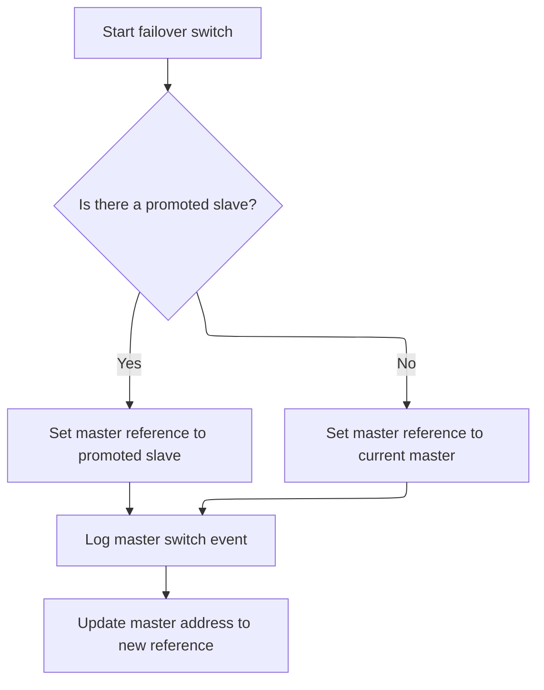
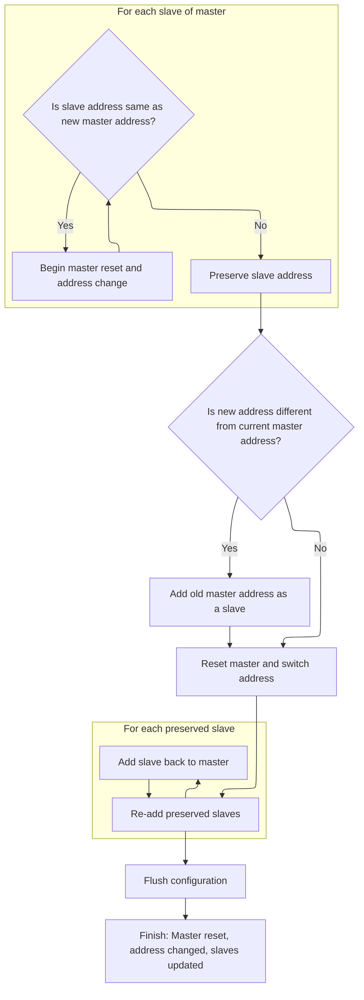

This document describes how Sentinel monitors Redis instances and manages failover to maintain high availability. The flow starts with a collection of Redis nodes, checks their status, and promotes a slave to master if needed. The configuration is updated and changes are saved, ensuring Redis clusters remain operational during failures.

# Processing Redis Instances and Handling Failover

<SwmSnippet path="/src/sentinel.c" line="3889">

---

In `sentinelHandleDictOfRedisInstances`, we start by iterating over every Redis instance in the dictionary. For each instance, we call sentinelHandleRedisInstance to handle monitoring and failover logic specific to that node. This sets up the groundwork for recursive handling of slaves and sentinels if the instance is a master, and also lets us check if any master needs a failover switch later.

```c
void sentinelHandleDictOfRedisInstances(dict *instances) {
    dictIterator *di;
    dictEntry *de;
    sentinelRedisInstance *switch_to_promoted = NULL;

    /* There are a number of things we need to perform against every master. */
    di = dictGetIterator(instances);
    while((de = dictNext(di)) != NULL) {
        sentinelRedisInstance *ri = dictGetVal(de);

        sentinelHandleRedisInstance(ri);
        if (ri->flags & SRI_MASTER) {
            sentinelHandleDictOfRedisInstances(ri->slaves);
            sentinelHandleDictOfRedisInstances(ri->sentinels);
            if (ri->failover_state == SENTINEL_FAILOVER_STATE_UPDATE_CONFIG) {
                switch_to_promoted = ri;
            }
        }
    }
```

---

</SwmSnippet>

<SwmSnippet path="/src/sentinel.c" line="3853">

---

`sentinelHandleRedisInstance` is where we handle monitoring and failover logic for a single Redis node. It checks for TILT mode to avoid acting during time instability, verifies if the instance is down (subjectively and objectively for masters), and runs the failover state machine for masters, coordinating with other sentinels as needed.

```c
void sentinelHandleRedisInstance(sentinelRedisInstance *ri) {
    /* ========== MONITORING HALF ============ */
    /* Every kind of instance */
    sentinelReconnectInstance(ri);
    sentinelSendPeriodicCommands(ri);

    /* ============== ACTING HALF ============= */
    /* We don't proceed with the acting half if we are in TILT mode.
     * TILT happens when we find something odd with the time, like a
     * sudden change in the clock. */
    if (sentinel.tilt) {
        if (mstime()-sentinel.tilt_start_time < SENTINEL_TILT_PERIOD) return;
        sentinel.tilt = 0;
        sentinelEvent(REDIS_WARNING,"-tilt",NULL,"#tilt mode exited");
    }

    /* Every kind of instance */
    sentinelCheckSubjectivelyDown(ri);

    /* Masters and slaves */
    if (ri->flags & (SRI_MASTER|SRI_SLAVE)) {
        /* Nothing so far. */
    }

    /* Only masters */
    if (ri->flags & SRI_MASTER) {
        sentinelCheckObjectivelyDown(ri);
        if (sentinelStartFailoverIfNeeded(ri))
            sentinelAskMasterStateToOtherSentinels(ri,SENTINEL_ASK_FORCED);
        sentinelFailoverStateMachine(ri);
        sentinelAskMasterStateToOtherSentinels(ri,SENTINEL_NO_FLAGS);
    }
}
```

---

</SwmSnippet>

<SwmSnippet path="/src/sentinel.c" line="3908">

---

Back in `sentinelHandleDictOfRedisInstances`, after handling each instance, we check if any master needs to be switched to a promoted slave. If so, we call sentinelFailoverSwitchToPromotedSlave to actually perform the failover switch. This keeps the failover logic clean and only triggers the switch when all checks are done.

```c
    if (switch_to_promoted)
        sentinelFailoverSwitchToPromotedSlave(switch_to_promoted);
```

---

</SwmSnippet>

## Switching Master to Promoted Slave



<SwmSnippet path="/src/sentinel.c" line="3794">

---

`sentinelFailoverSwitchToPromotedSlave` logs the master switch event and then calls sentinelResetMasterAndChangeAddress to update the master reference to the promoted slave. This makes sure the system tracks the new master correctly.

```c
void sentinelFailoverSwitchToPromotedSlave(sentinelRedisInstance *master) {
    sentinelRedisInstance *ref = master->promoted_slave ?
                                 master->promoted_slave : master;

    sentinelEvent(REDIS_WARNING,"+switch-master",master,"%s %s %d %s %d",
        master->name, master->addr->ip, master->addr->port,
        ref->addr->ip, ref->addr->port);

    sentinelResetMasterAndChangeAddress(master,ref->addr->ip,ref->addr->port);
}
```

---

</SwmSnippet>

## Resetting Master and Updating Configuration



<SwmSnippet path="/src/sentinel.c" line="1229">

---

In `sentinelResetMasterAndChangeAddress`, we build a new address for the master, collect all slaves except the one matching the new address, and if the address is changing, we add the old master as a slave. This sets up the master and its slaves for the reset and address switch.

```c
int sentinelResetMasterAndChangeAddress(sentinelRedisInstance *master, char *ip, int port) {
    sentinelAddr *oldaddr, *newaddr;
    sentinelAddr **slaves = NULL;
    int numslaves = 0, j;
    dictIterator *di;
    dictEntry *de;

    newaddr = createSentinelAddr(ip,port);
    if (newaddr == NULL) return REDIS_ERR;

    /* Make a list of slaves to add back after the reset.
     * Don't include the one having the address we are switching to. */
    di = dictGetIterator(master->slaves);
    while((de = dictNext(di)) != NULL) {
        sentinelRedisInstance *slave = dictGetVal(de);

        if (sentinelAddrIsEqual(slave->addr,newaddr)) continue;
        slaves = zrealloc(slaves,sizeof(sentinelAddr*)*(numslaves+1));
        slaves[numslaves++] = createSentinelAddr(slave->addr->ip,
                                                 slave->addr->port);
    }
```

---

</SwmSnippet>

<SwmSnippet path="/src/sentinel.c" line="1250">

---

After prepping the slave list and possibly adding the old master as a slave, we reset the master, switch its address, and re-add each slave to the master. This keeps the cluster relationships up to date before moving on to cleanup and config flush.

```c
    dictReleaseIterator(di);

    /* If we are switching to a different address, include the old address
     * as a slave as well, so that we'll be able to sense / reconfigure
     * the old master. */
    if (!sentinelAddrIsEqual(newaddr,master->addr)) {
        slaves = zrealloc(slaves,sizeof(sentinelAddr*)*(numslaves+1));
        slaves[numslaves++] = createSentinelAddr(master->addr->ip,
                                                 master->addr->port);
    }

    /* Reset and switch address. */
    sentinelResetMaster(master,SENTINEL_RESET_NO_SENTINELS);
    oldaddr = master->addr;
    master->addr = newaddr;
    master->o_down_since_time = 0;
    master->s_down_since_time = 0;

    /* Add slaves back. */
    for (j = 0; j < numslaves; j++) {
        sentinelRedisInstance *slave;

        slave = createSentinelRedisInstance(NULL,SRI_SLAVE,slaves[j]->ip,
                    slaves[j]->port, master->quorum, master);
        releaseSentinelAddr(slaves[j]);
        if (slave) sentinelEvent(REDIS_NOTICE,"+slave",slave,"%@");
    }
```

---

</SwmSnippet>

<SwmSnippet path="/src/sentinel.c" line="1277">

---

After updating the master and slaves, we clean up memory and call sentinelFlushConfig to make sure the new setup is saved to disk. This locks in the changes for Sentinel and the rest of the system.

```c
    zfree(slaves);

    /* Release the old address at the end so we are safe even if the function
     * gets the master->addr->ip and master->addr->port as arguments. */
    releaseSentinelAddr(oldaddr);
    sentinelFlushConfig();
    return REDIS_OK;
}
```

---

</SwmSnippet>

<SwmSnippet path="/src/sentinel.c" line="1597">

---

`sentinelFlushConfig` rewrites the config file, forces the changes to disk with fsync, and restores the server timing. This guarantees the new setup is saved and durable.

```c
void sentinelFlushConfig(void) {
    int fd = -1;
    int saved_hz = server.hz;
    int rewrite_status;

    server.hz = REDIS_DEFAULT_HZ;
    rewrite_status = rewriteConfig(server.configfile);
    server.hz = saved_hz;

    if (rewrite_status == -1) goto werr;
    if ((fd = open(server.configfile,O_RDONLY)) == -1) goto werr;
    if (fsync(fd) == -1) goto werr;
    if (close(fd) == EOF) goto werr;
    return;

werr:
    if (fd != -1) close(fd);
    redisLog(REDIS_WARNING,"WARNING: Sentinel was not able to save the new configuration on disk!!!: %s", strerror(errno));
}
```

---

</SwmSnippet>

## Finalizing Instance Handling

<SwmSnippet path="/src/sentinel.c" line="3910">

---

After returning from sentinelFailoverSwitchToPromotedSlave in `sentinelHandleDictOfRedisInstances`, we wrap up by releasing the iterator and finishing the function. At this point, all Redis instances have been handled and any required failover switches are done.

```c
    dictReleaseIterator(di);
}
```

---

</SwmSnippet>

&nbsp;

*This is an auto-generated document by Swimm 🌊 and has not yet been verified by a human*

<SwmMeta version="3.0.0" repo-id="Z2l0aHViJTNBJTNBUmVkaXNDc2FtcGxlJTNBJTNBdW1hbGluZ2Fzd2FtaQ==" repo-name="RedisCsample"><sup>Powered by [Swimm](https://app.swimm.io/)</sup></SwmMeta>
