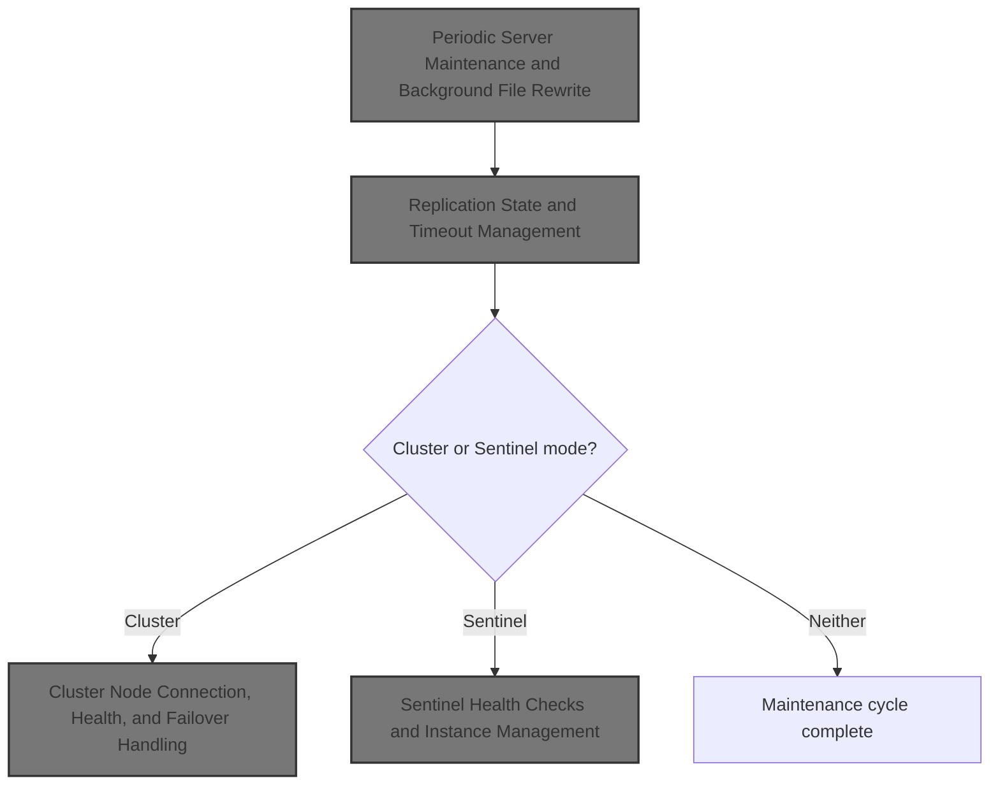
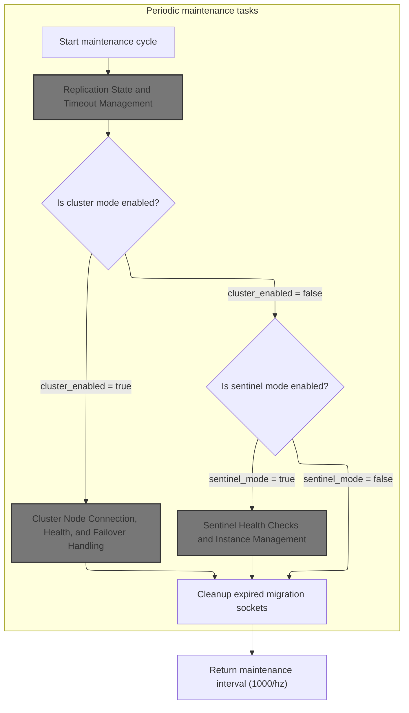

This document describes how the server periodically performs maintenance and background management tasks to keep the system healthy and available. Depending on configuration, the flow manages replication, cluster health, or sentinel monitoring, and cleans up resources. The server's timer triggers these tasks, which update the server's state and ensure ongoing reliability.



# Periodic Server Maintenance and Background File Rewrite



<SwmSnippet path="/src/redis.c" line="1079">

---

In <SwmToken path="src/redis.c" pos="1079:2:2" line-data="int serverCron(struct aeEventLoop *eventLoop, long long id, void *clientData) {">`serverCron`</SwmToken>, we start the periodic maintenance: update clocks, track memory stats, and schedule metrics/logging at different intervals. This sets up the environment for the rest of the cron tasks.

```c
int serverCron(struct aeEventLoop *eventLoop, long long id, void *clientData) {
    int j;
    REDIS_NOTUSED(eventLoop);
    REDIS_NOTUSED(id);
    REDIS_NOTUSED(clientData);

    /* Software watchdog: deliver the SIGALRM that will reach the signal
     * handler if we don't return here fast enough. */
    if (server.watchdog_period) watchdogScheduleSignal(server.watchdog_period);

    /* Update the time cache. */
    updateCachedTime();

    run_with_period(100) {
        trackInstantaneousMetric(REDIS_METRIC_COMMAND,server.stat_numcommands);
        trackInstantaneousMetric(REDIS_METRIC_NET_INPUT,
                server.stat_net_input_bytes);
        trackInstantaneousMetric(REDIS_METRIC_NET_OUTPUT,
                server.stat_net_output_bytes);
    }

    /* We have just REDIS_LRU_BITS bits per object for LRU information.
     * So we use an (eventually wrapping) LRU clock.
     *
     * Note that even if the counter wraps it's not a big problem,
     * everything will still work but some object will appear younger
     * to Redis. However for this to happen a given object should never be
     * touched for all the time needed to the counter to wrap, which is
     * not likely.
     *
     * Note that you can change the resolution altering the
     * REDIS_LRU_CLOCK_RESOLUTION define. */
    server.lruclock = getLRUClock();

    /* Record the max memory used since the server was started. */
    if (zmalloc_used_memory() > server.stat_peak_memory)
        server.stat_peak_memory = zmalloc_used_memory();

    /* Sample the RSS here since this is a relatively slow call. */
    server.resident_set_size = zmalloc_get_rss();

    /* We received a SIGTERM, shutting down here in a safe way, as it is
     * not ok doing so inside the signal handler. */
    if (server.shutdown_asap) {
        if (prepareForShutdown(0) == REDIS_OK) exit(0);
        redisLog(REDIS_WARNING,"SIGTERM received but errors trying to shut down the server, check the logs for more information");
        server.shutdown_asap = 0;
    }

    /* Show some info about non-empty databases */
    run_with_period(5000) {
        for (j = 0; j < server.dbnum; j++) {
            long long size, used, vkeys;

            size = dictSlots(server.db[j].dict);
            used = dictSize(server.db[j].dict);
            vkeys = dictSize(server.db[j].expires);
            if (used || vkeys) {
                redisLog(REDIS_VERBOSE,"DB %d: %lld keys (%lld volatile) in %lld slots HT.",j,used,vkeys,size);
                /* dictPrintStats(server.dict); */
            }
        }
```

---

</SwmSnippet>

<SwmSnippet path="/src/redis.c" line="1143">

---

Here we handle client logging, run async client and DB operations, and check if we need to start a scheduled AOF rewrite after a BGSAVE. We also check if any background save or rewrite process finished, handle their termination, and decide if we need to trigger new background saves based on configured thresholds.

```c
    /* Show information about connected clients */
    if (!server.sentinel_mode) {
        run_with_period(5000) {
            redisLog(REDIS_VERBOSE,
                "%lu clients connected (%lu slaves), %zu bytes in use",
                listLength(server.clients)-listLength(server.slaves),
                listLength(server.slaves),
                zmalloc_used_memory());
        }
    }

    /* We need to do a few operations on clients asynchronously. */
    clientsCron();

    /* Handle background operations on Redis databases. */
    databasesCron();

    /* Start a scheduled AOF rewrite if this was requested by the user while
     * a BGSAVE was in progress. */
    if (server.rdb_child_pid == -1 && server.aof_child_pid == -1 &&
        server.aof_rewrite_scheduled)
    {
        rewriteAppendOnlyFileBackground();
    }

    /* Check if a background saving or AOF rewrite in progress terminated. */
    if (server.rdb_child_pid != -1 || server.aof_child_pid != -1) {
        int statloc;
        pid_t pid;

        if ((pid = wait3(&statloc,WNOHANG,NULL)) != 0) {
            int exitcode = WEXITSTATUS(statloc);
            int bysignal = 0;

            if (WIFSIGNALED(statloc)) bysignal = WTERMSIG(statloc);

            if (pid == -1) {
                redisLog(LOG_WARNING,"wait3() returned an error: %s. "
                    "rdb_child_pid = %d, aof_child_pid = %d",
                    strerror(errno),
                    (int) server.rdb_child_pid,
                    (int) server.aof_child_pid);
            } else if (pid == server.rdb_child_pid) {
                backgroundSaveDoneHandler(exitcode,bysignal);
            } else if (pid == server.aof_child_pid) {
                backgroundRewriteDoneHandler(exitcode,bysignal);
            } else {
                redisLog(REDIS_WARNING,
                    "Warning, detected child with unmatched pid: %ld",
                    (long)pid);
            }
            updateDictResizePolicy();
        }
    } else {
        /* If there is not a background saving/rewrite in progress check if
         * we have to save/rewrite now */
         for (j = 0; j < server.saveparamslen; j++) {
            struct saveparam *sp = server.saveparams+j;

            /* Save if we reached the given amount of changes,
             * the given amount of seconds, and if the latest bgsave was
             * successful or if, in case of an error, at least
             * REDIS_BGSAVE_RETRY_DELAY seconds already elapsed. */
            if (server.dirty >= sp->changes &&
                server.unixtime-server.lastsave > sp->seconds &&
                (server.unixtime-server.lastbgsave_try >
                 REDIS_BGSAVE_RETRY_DELAY ||
                 server.lastbgsave_status == REDIS_OK))
            {
                redisLog(REDIS_NOTICE,"%d changes in %d seconds. Saving...",
                    sp->changes, (int)sp->seconds);
                rdbSaveBackground(server.rdb_filename);
                break;
            }
         }
```

---

</SwmSnippet>

<SwmSnippet path="/src/redis.c" line="1219">

---

If the AOF file has grown past a set percentage, we kick off a background rewrite to keep the file size reasonable.

```c
         /* Trigger an AOF rewrite if needed */
         if (server.rdb_child_pid == -1 &&
             server.aof_child_pid == -1 &&
             server.aof_rewrite_perc &&
             server.aof_current_size > server.aof_rewrite_min_size)
         {
            long long base = server.aof_rewrite_base_size ?
                            server.aof_rewrite_base_size : 1;
            long long growth = (server.aof_current_size*100/base) - 100;
            if (growth >= server.aof_rewrite_perc) {
                redisLog(REDIS_NOTICE,"Starting automatic rewriting of AOF on %lld%% growth",growth);
                rewriteAppendOnlyFileBackground();
            }
         }
    }


```

---

</SwmSnippet>

<SwmSnippet path="/src/aof.c" line="1269">

---

<SwmToken path="src/aof.c" pos="1269:2:2" line-data="int rewriteAppendOnlyFileBackground(void) {">`rewriteAppendOnlyFileBackground`</SwmToken> forks a child to rewrite the AOF file in the background, updates server state, and ensures the next AOF buffer starts cleanly. It also flushes the replication script cache for consistency.

```c
int rewriteAppendOnlyFileBackground(void) {
    pid_t childpid;
    long long start;

    if (server.aof_child_pid != -1) return REDIS_ERR;
    if (aofCreatePipes() != REDIS_OK) return REDIS_ERR;
    start = ustime();
    if ((childpid = fork()) == 0) {
        char tmpfile[256];

        /* Child */
        closeListeningSockets(0);
        redisSetProcTitle("redis-aof-rewrite");
        snprintf(tmpfile,256,"temp-rewriteaof-bg-%d.aof", (int) getpid());
        if (rewriteAppendOnlyFile(tmpfile) == REDIS_OK) {
            size_t private_dirty = zmalloc_get_private_dirty();

            if (private_dirty) {
                redisLog(REDIS_NOTICE,
                    "AOF rewrite: %zu MB of memory used by copy-on-write",
                    private_dirty/(1024*1024));
            }
            exitFromChild(0);
        } else {
            exitFromChild(1);
        }
    } else {
        /* Parent */
        server.stat_fork_time = ustime()-start;
        server.stat_fork_rate = (double) zmalloc_used_memory() * 1000000 / server.stat_fork_time / (1024*1024*1024); /* GB per second. */
        latencyAddSampleIfNeeded("fork",server.stat_fork_time/1000);
        if (childpid == -1) {
            redisLog(REDIS_WARNING,
                "Can't rewrite append only file in background: fork: %s",
                strerror(errno));
            return REDIS_ERR;
        }
        redisLog(REDIS_NOTICE,
            "Background append only file rewriting started by pid %d",childpid);
        server.aof_rewrite_scheduled = 0;
        server.aof_rewrite_time_start = time(NULL);
        server.aof_child_pid = childpid;
        updateDictResizePolicy();
        /* We set appendseldb to -1 in order to force the next call to the
         * feedAppendOnlyFile() to issue a SELECT command, so the differences
         * accumulated by the parent into server.aof_rewrite_buf will start
         * with a SELECT statement and it will be safe to merge. */
        server.aof_selected_db = -1;
        replicationScriptCacheFlush();
        return REDIS_OK;
    }
    return REDIS_OK; /* unreached */
}
```

---

</SwmSnippet>

<SwmSnippet path="/src/redis.c" line="1236">

---

We just returned from the AOF rewrite logic. Now, <SwmToken path="src/redis.c" pos="1079:2:2" line-data="int serverCron(struct aeEventLoop *eventLoop, long long id, void *clientData) {">`serverCron`</SwmToken> flushes any postponed AOF buffers, handles AOF write errors, frees async clients, and clears paused client flags. Then, it calls <SwmToken path="src/redis.c" pos="1257:6:6" line-data="    run_with_period(1000) replicationCron();">`replicationCron`</SwmToken> every second to keep replication state and connections in check.

```c
    /* AOF postponed flush: Try at every cron cycle if the slow fsync
     * completed. */
    if (server.aof_flush_postponed_start) flushAppendOnlyFile(0);

    /* AOF write errors: in this case we have a buffer to flush as well and
     * clear the AOF error in case of success to make the DB writable again,
     * however to try every second is enough in case of 'hz' is set to
     * an higher frequency. */
    run_with_period(1000) {
        if (server.aof_last_write_status == REDIS_ERR)
            flushAppendOnlyFile(0);
    }

    /* Close clients that need to be closed asynchronous */
    freeClientsInAsyncFreeQueue();

    /* Clear the paused clients flag if needed. */
    clientsArePaused(); /* Don't check return value, just use the side effect. */

    /* Replication cron function -- used to reconnect to master and
     * to detect transfer failures. */
    run_with_period(1000) replicationCron();

```

---

</SwmSnippet>

## Replication State and Timeout Management

```mermaid
%%{init: {"flowchart": {"defaultRenderer": "elk"}} }%%
flowchart TD
  node1["Start replication health check"]
  click node1 openCode "src/replication.c:2186:2189"
  node1 --> node2{"Is connection to master timed out?"}
  click node2 openCode "src/replication.c:2190:2197"
  node2 -->|"Yes (Timeout exceeded)"| node3["Handle failed master connection"]
  click node3 openCode "src/replication.c:2195:2197"
  node2 -->|"No"| node4{"Is bulk transfer timed out?"}
  click node4 openCode "src/replication.c:2199:2205"
  node4 -->|"Yes (Timeout exceeded)"| node5["Handle failed bulk transfer"]
  click node5 openCode "src/replication.c:2203:2205"
  node4 -->|"No"| node6{"Is master unresponsive?"}
  click node6 openCode "src/replication.c:2207:2213"
  node6 -->|"Yes (No data/PING)"| node7["Disconnect master"]
  click node7 openCode "src/replication.c:2211:2213"
  node6 -->|"No"| node8{"Should connect to master?"}
  click node8 openCode "src/replication.c:2216:2222"
  node8 -->|"Yes"| node9["Attempt connection to master"]
  click node9 openCode "src/replication.c:2219:2221"
  node8 -->|"No"| node10{"Should send ACK to master?"}
  click node10 openCode "src/replication.c:2227:2229"
  node10 -->|"Yes"| node11["Send ACK to master"]
  click node11 openCode "src/replication.c:2229:2229"
  node10 -->|"No"| node12

  subgraph loop1["For each attached slave"]
    node12 --> node13["Send PING to slave"]
    click node13 openCode "src/replication.c:2240:2245"
    node13 --> node14{"Is slave waiting for sync?"}
    click node14 openCode "src/replication.c:2257:2264"
    node14 -->|"Yes"| node15["Refresh slave connection"]
    click node15 openCode "src/replication.c:2261:2264"
    node14 -->|"No"| node16
  end

  subgraph loop2["For each attached slave"]
    node16 --> node17{"Is slave timed out?"}
    click node17 openCode "src/replication.c:2276:2279"
    node17 -->|"Yes"| node18["Disconnect slave"]
    click node18 openCode "src/replication.c:2280:2282"
    node17 -->|"No"| node19
  end

  node19 --> node20{"No slaves for backlog time limit?"}
  click node20 openCode "src/replication.c:2289:2301"
  node20 -->|"Yes"| node21["Free replication backlog"]
  click node21 openCode "src/replication.c:2295:2300"
  node20 -->|"No"| node22{"Should flush script cache?"}
  click node22 openCode "src/replication.c:2306:2311"
  node22 -->|"Yes"| node23["Flush script cache"]
  click node23 openCode "src/replication.c:2310:2311"
  node22 -->|"No"| node24

  subgraph loop3["For each attached slave"]
    node24 --> node25{"Is diskless sync delay exceeded?"}
    click node25 openCode "src/replication.c:2330:2337"
    node25 -->|"Yes"| node26["Trigger background save"]
    click node26 openCode "src/replication.c:2342:2343"
    node25 -->|"No"| node27
  end

  node27 --> node28["Finish replication health check"]
  click node28 openCode "src/replication.c:2347:2349"

classDef HeadingStyle fill:#777777,stroke:#333,stroke-width:2px;

%% Swimm:
%% %%{init: {"flowchart": {"defaultRenderer": "elk"}} }%%
%% flowchart TD
%%   node1["Start replication health check"]
%%   click node1 openCode "<SwmPath>[src/replication.c](src/replication.c)</SwmPath>:2186:2189"
%%   node1 --> node2{"Is connection to master timed out?"}
%%   click node2 openCode "<SwmPath>[src/replication.c](src/replication.c)</SwmPath>:2190:2197"
%%   node2 -->|"Yes (Timeout exceeded)"| node3["Handle failed master connection"]
%%   click node3 openCode "<SwmPath>[src/replication.c](src/replication.c)</SwmPath>:2195:2197"
%%   node2 -->|"No"| node4{"Is bulk transfer timed out?"}
%%   click node4 openCode "<SwmPath>[src/replication.c](src/replication.c)</SwmPath>:2199:2205"
%%   node4 -->|"Yes (Timeout exceeded)"| node5["Handle failed bulk transfer"]
%%   click node5 openCode "<SwmPath>[src/replication.c](src/replication.c)</SwmPath>:2203:2205"
%%   node4 -->|"No"| node6{"Is master unresponsive?"}
%%   click node6 openCode "<SwmPath>[src/replication.c](src/replication.c)</SwmPath>:2207:2213"
%%   node6 -->|"Yes (No data/PING)"| node7["Disconnect master"]
%%   click node7 openCode "<SwmPath>[src/replication.c](src/replication.c)</SwmPath>:2211:2213"
%%   node6 -->|"No"| node8{"Should connect to master?"}
%%   click node8 openCode "<SwmPath>[src/replication.c](src/replication.c)</SwmPath>:2216:2222"
%%   node8 -->|"Yes"| node9["Attempt connection to master"]
%%   click node9 openCode "<SwmPath>[src/replication.c](src/replication.c)</SwmPath>:2219:2221"
%%   node8 -->|"No"| node10{"Should send ACK to master?"}
%%   click node10 openCode "<SwmPath>[src/replication.c](src/replication.c)</SwmPath>:2227:2229"
%%   node10 -->|"Yes"| node11["Send ACK to master"]
%%   click node11 openCode "<SwmPath>[src/replication.c](src/replication.c)</SwmPath>:2229:2229"
%%   node10 -->|"No"| node12
%% 
%%   subgraph loop1["For each attached slave"]
%%     node12 --> node13["Send PING to slave"]
%%     click node13 openCode "<SwmPath>[src/replication.c](src/replication.c)</SwmPath>:2240:2245"
%%     node13 --> node14{"Is slave waiting for sync?"}
%%     click node14 openCode "<SwmPath>[src/replication.c](src/replication.c)</SwmPath>:2257:2264"
%%     node14 -->|"Yes"| node15["Refresh slave connection"]
%%     click node15 openCode "<SwmPath>[src/replication.c](src/replication.c)</SwmPath>:2261:2264"
%%     node14 -->|"No"| node16
%%   end
%% 
%%   subgraph loop2["For each attached slave"]
%%     node16 --> node17{"Is slave timed out?"}
%%     click node17 openCode "<SwmPath>[src/replication.c](src/replication.c)</SwmPath>:2276:2279"
%%     node17 -->|"Yes"| node18["Disconnect slave"]
%%     click node18 openCode "<SwmPath>[src/replication.c](src/replication.c)</SwmPath>:2280:2282"
%%     node17 -->|"No"| node19
%%   end
%% 
%%   node19 --> node20{"No slaves for backlog time limit?"}
%%   click node20 openCode "<SwmPath>[src/replication.c](src/replication.c)</SwmPath>:2289:2301"
%%   node20 -->|"Yes"| node21["Free replication backlog"]
%%   click node21 openCode "<SwmPath>[src/replication.c](src/replication.c)</SwmPath>:2295:2300"
%%   node20 -->|"No"| node22{"Should flush script cache?"}
%%   click node22 openCode "<SwmPath>[src/replication.c](src/replication.c)</SwmPath>:2306:2311"
%%   node22 -->|"Yes"| node23["Flush script cache"]
%%   click node23 openCode "<SwmPath>[src/replication.c](src/replication.c)</SwmPath>:2310:2311"
%%   node22 -->|"No"| node24
%% 
%%   subgraph loop3["For each attached slave"]
%%     node24 --> node25{"Is diskless sync delay exceeded?"}
%%     click node25 openCode "<SwmPath>[src/replication.c](src/replication.c)</SwmPath>:2330:2337"
%%     node25 -->|"Yes"| node26["Trigger background save"]
%%     click node26 openCode "<SwmPath>[src/replication.c](src/replication.c)</SwmPath>:2342:2343"
%%     node25 -->|"No"| node27
%%   end
%% 
%%   node27 --> node28["Finish replication health check"]
%%   click node28 openCode "<SwmPath>[src/replication.c](src/replication.c)</SwmPath>:2347:2349"
%% 
%% classDef HeadingStyle fill:#777777,stroke:#333,stroke-width:2px;
```



<SwmSnippet path="/src/replication.c" line="2186">

---

In <SwmToken path="src/replication.c" pos="2186:2:2" line-data="void replicationCron(void) {">`replicationCron`</SwmToken> we check for replication timeouts in various states, handle failed connections, and try to reconnect if needed. We also send periodic <SwmToken path="src/replication.c" pos="2055:13:13" line-data=" * - Once we receive enough ACKs for a given offset or when the timeout">`ACKs`</SwmToken> to the master and ping attached slaves to keep connections alive and detect disconnections. For slaves waiting on RDB, we send newlines to refresh their timers.

```c
void replicationCron(void) {
    static long long replication_cron_loops = 0;

    /* Non blocking connection timeout? */
    if (server.masterhost &&
        (server.repl_state == REDIS_REPL_CONNECTING ||
         slaveIsInHandshakeState()) &&
         (time(NULL)-server.repl_transfer_lastio) > server.repl_timeout)
    {
        redisLog(REDIS_WARNING,"Timeout connecting to the MASTER...");
        undoConnectWithMaster();
    }

    /* Bulk transfer I/O timeout? */
    if (server.masterhost && server.repl_state == REDIS_REPL_TRANSFER &&
        (time(NULL)-server.repl_transfer_lastio) > server.repl_timeout)
    {
        redisLog(REDIS_WARNING,"Timeout receiving bulk data from MASTER... If the problem persists try to set the 'repl-timeout' parameter in redis.conf to a larger value.");
        replicationAbortSyncTransfer();
    }

    /* Timed out master when we are an already connected slave? */
    if (server.masterhost && server.repl_state == REDIS_REPL_CONNECTED &&
        (time(NULL)-server.master->lastinteraction) > server.repl_timeout)
    {
        redisLog(REDIS_WARNING,"MASTER timeout: no data nor PING received...");
        freeClient(server.master);
    }

    /* Check if we should connect to a MASTER */
    if (server.repl_state == REDIS_REPL_CONNECT) {
        redisLog(REDIS_NOTICE,"Connecting to MASTER %s:%d",
            server.masterhost, server.masterport);
        if (connectWithMaster() == REDIS_OK) {
            redisLog(REDIS_NOTICE,"MASTER <-> SLAVE sync started");
        }
    }

    /* Send ACK to master from time to time.
     * Note that we do not send periodic acks to masters that don't
     * support PSYNC and replication offsets. */
    if (server.masterhost && server.master &&
        !(server.master->flags & REDIS_PRE_PSYNC))
        replicationSendAck();

    /* If we have attached slaves, PING them from time to time.
     * So slaves can implement an explicit timeout to masters, and will
     * be able to detect a link disconnection even if the TCP connection
     * will not actually go down. */
    listIter li;
    listNode *ln;
    robj *ping_argv[1];

    /* First, send PING according to ping_slave_period. */
    if ((replication_cron_loops % server.repl_ping_slave_period) == 0) {
        ping_argv[0] = createStringObject("PING",4);
        replicationFeedSlaves(server.slaves, server.slaveseldb,
            ping_argv, 1);
        decrRefCount(ping_argv[0]);
    }

    /* Second, send a newline to all the slaves in pre-synchronization
     * stage, that is, slaves waiting for the master to create the RDB file.
     * The newline will be ignored by the slave but will refresh the
     * last-io timer preventing a timeout. In this case we ignore the
     * ping period and refresh the connection once per second since certain
     * timeouts are set at a few seconds (example: PSYNC response). */
    listRewind(server.slaves,&li);
    while((ln = listNext(&li))) {
        redisClient *slave = ln->value;

        if (slave->replstate == REDIS_REPL_WAIT_BGSAVE_START ||
            (slave->replstate == REDIS_REPL_WAIT_BGSAVE_END &&
             server.rdb_child_type != REDIS_RDB_CHILD_TYPE_SOCKET))
        {
            if (write(slave->fd, "\n", 1) == -1) {
                /* Don't worry, it's just a ping. */
            }
        }
    }
```

---

</SwmSnippet>

<SwmSnippet path="/src/replication.c" line="2267">

---

After handling <SwmToken path="src/cluster.c" pos="1804:20:22" line-data="         * Note: this MUST happen after we update the master/slave state">`master/slave`</SwmToken> communication, we loop through connected slaves and disconnect any that haven't acknowledged replication progress within the timeout. This keeps the replication set clean and responsive.

```c
    /* Disconnect timedout slaves. */
    if (listLength(server.slaves)) {
        listIter li;
        listNode *ln;

        listRewind(server.slaves,&li);
        while((ln = listNext(&li))) {
            redisClient *slave = ln->value;

            if (slave->replstate != REDIS_REPL_ONLINE) continue;
            if (slave->flags & REDIS_PRE_PSYNC) continue;
            if ((server.unixtime - slave->repl_ack_time) > server.repl_timeout)
            {
                redisLog(REDIS_WARNING, "Disconnecting timedout slave: %s",
                    replicationGetSlaveName(slave));
                freeClient(slave);
            }
        }
```

---

</SwmSnippet>

<SwmSnippet path="/src/replication.c" line="2287">

---

After disconnecting timed-out slaves, we free the replication backlog if no slaves are connected, flush the script cache if AOF is off and no slaves are present, and check if we need to trigger a BGSAVE for diskless replication if slaves are waiting.

```c
    /* If we have no attached slaves and there is a replication backlog
     * using memory, free it after some (configured) time. */
    if (listLength(server.slaves) == 0 && server.repl_backlog_time_limit &&
        server.repl_backlog)
    {
        time_t idle = server.unixtime - server.repl_no_slaves_since;

        if (idle > server.repl_backlog_time_limit) {
            freeReplicationBacklog();
            redisLog(REDIS_NOTICE,
                "Replication backlog freed after %d seconds "
                "without connected slaves.",
                (int) server.repl_backlog_time_limit);
        }
    }

    /* If AOF is disabled and we no longer have attached slaves, we can
     * free our Replication Script Cache as there is no need to propagate
     * EVALSHA at all. */
    if (listLength(server.slaves) == 0 &&
        server.aof_state == REDIS_AOF_OFF &&
        listLength(server.repl_scriptcache_fifo) != 0)
    {
        replicationScriptCacheFlush();
    }

    /* If we are using diskless replication and there are slaves waiting
     * in WAIT_BGSAVE_START state, check if enough seconds elapsed and
     * start a BGSAVE.
     *
     * This code is also useful to trigger a BGSAVE if the diskless
     * replication was turned off with CONFIG SET, while there were already
     * slaves in WAIT_BGSAVE_START state. */
    if (server.rdb_child_pid == -1 && server.aof_child_pid == -1) {
        time_t idle, max_idle = 0;
        int slaves_waiting = 0;
        int mincapa = -1;
        listNode *ln;
        listIter li;

        listRewind(server.slaves,&li);
        while((ln = listNext(&li))) {
            redisClient *slave = ln->value;
            if (slave->replstate == REDIS_REPL_WAIT_BGSAVE_START) {
                idle = server.unixtime - slave->lastinteraction;
                if (idle > max_idle) max_idle = idle;
                slaves_waiting++;
                mincapa = (mincapa == -1) ? slave->slave_capa :
                                            (mincapa & slave->slave_capa);
            }
        }
```

---

</SwmSnippet>

<SwmSnippet path="/src/replication.c" line="2339">

---

After handling backlog and BGSAVE triggers, we refresh the count of good slaves (those with low lag) for safety checks and failover logic, then increment the cron loop counter.

```c
        if (slaves_waiting && max_idle > server.repl_diskless_sync_delay) {
            /* Start a BGSAVE. Usually with socket target, or with disk target
             * if there was a recent socket -> disk config change. */
            startBgsaveForReplication(mincapa);
        }
    }

    /* Refresh the number of slaves with lag <= min-slaves-max-lag. */
    refreshGoodSlavesCount();
    replication_cron_loops++; /* Incremented with frequency 1 HZ. */
}
```

---

</SwmSnippet>

## Cluster Health and Node Connection Management

<SwmSnippet path="/src/redis.c" line="1259">

---

After returning from <SwmToken path="src/redis.c" pos="1257:6:6" line-data="    run_with_period(1000) replicationCron();">`replicationCron`</SwmToken>, <SwmToken path="src/redis.c" pos="1079:2:2" line-data="int serverCron(struct aeEventLoop *eventLoop, long long id, void *clientData) {">`serverCron`</SwmToken> calls <SwmToken path="src/redis.c" pos="1261:9:9" line-data="        if (server.cluster_enabled) clusterCron();">`clusterCron`</SwmToken> every 100ms if clustering is enabled. This keeps cluster node connections alive and manages cluster health.

```c
    /* Run the Redis Cluster cron. */
    run_with_period(100) {
        if (server.cluster_enabled) clusterCron();
    }

```

---

</SwmSnippet>

## Cluster Node Connection, Health, and Failover Handling

```mermaid
%%{init: {"flowchart": {"defaultRenderer": "elk"}} }%%
flowchart TD
    node1["Start cluster health check"]
    click node1 openCode "src/cluster.c:3062:3075"
    subgraph loop1["For each node in cluster"]
        loop1a{"Handshake timeout exceeded?"}
        click loop1a openCode "src/cluster.c:3092:3095"
        loop1a -->|"Yes (handshake_timeout > 1000ms)"| loop1b["Remove node"]
        click loop1b openCode "src/cluster.c:3093:3094"
        loop1a -->|"No"| loop1c{"Node disconnected?"}
        click loop1c openCode "src/cluster.c:3097:3146"
        loop1c -->|"Yes"| loop1d["Reconnect node"]
        click loop1d openCode "src/cluster.c:3102:3146"
        loop1c -->|"No"| loop1e["Skip"]
    end
    loop1 --> loop3
    subgraph loop3["Every 10 iterations"]
        loop3a{"Is iteration % 10 == 0?"}
        click loop3a openCode "src/cluster.c:3152:3169"
        loop3a -->|"Yes"| loop3b["Ping random node with oldest pong_received"]
        click loop3b openCode "src/cluster.c:3170:3173"
        loop3a -->|"No"| loop3c["Skip random ping"]
    end
    loop3 --> loop2
    subgraph loop2["For each node in cluster"]
        loop2a{"Node possibly failing (missed PONG)?"}
        click loop2a openCode "src/cluster.c:3259:3268"
        loop2a -->|"Yes (delay > cluster_node_timeout)"| loop2b["Mark node as possibly failing"]
        click loop2b openCode "src/cluster.c:3263:3267"
        loop2a -->|"No"| loop2c["Skip"]
    end
    loop2 --> node2{"Slave eligible for replication?"}
    click node2 openCode "src/cluster.c:3275:3281"
    node2 -->|"Yes (master up and address known)"| node3["Enable replication"]
    click node3 openCode "src/cluster.c:3280:3281"
    node2 -->|"No"| node4["Skip"]
    node4 --> node5a["Handle manual failover"]
    click node5a openCode "src/cluster.c:3284:3287"
    node5a --> node5b["Handle slave migration"]
    click node5b openCode "src/cluster.c:3289:3296"
    node5b --> node6{"Update cluster state?"}
    click node6 openCode "src/cluster.c:3298:3299"
    node6 -->|"Yes (update_state or cluster in FAIL)"| node7["Update cluster state"]
    click node7 openCode "src/cluster.c:3299:3300"
    node6 -->|"No"| node8["End"]
    click node8 openCode "src/cluster.c:3300:3300"
classDef HeadingStyle fill:#777777,stroke:#333,stroke-width:2px;

%% Swimm:
%% %%{init: {"flowchart": {"defaultRenderer": "elk"}} }%%
%% flowchart TD
%%     node1["Start cluster health check"]
%%     click node1 openCode "<SwmPath>[src/cluster.c](src/cluster.c)</SwmPath>:3062:3075"
%%     subgraph loop1["For each node in cluster"]
%%         loop1a{"Handshake timeout exceeded?"}
%%         click loop1a openCode "<SwmPath>[src/cluster.c](src/cluster.c)</SwmPath>:3092:3095"
%%         loop1a -->|"Yes (<SwmToken path="src/cluster.c" pos="3072:3:3" line-data="    mstime_t handshake_timeout;">`handshake_timeout`</SwmToken> > 1000ms)"| loop1b["Remove node"]
%%         click loop1b openCode "<SwmPath>[src/cluster.c](src/cluster.c)</SwmPath>:3093:3094"
%%         loop1a -->|"No"| loop1c{"Node disconnected?"}
%%         click loop1c openCode "<SwmPath>[src/cluster.c](src/cluster.c)</SwmPath>:3097:3146"
%%         loop1c -->|"Yes"| loop1d["Reconnect node"]
%%         click loop1d openCode "<SwmPath>[src/cluster.c](src/cluster.c)</SwmPath>:3102:3146"
%%         loop1c -->|"No"| loop1e["Skip"]
%%     end
%%     loop1 --> loop3
%%     subgraph loop3["Every 10 iterations"]
%%         loop3a{"Is iteration % 10 == 0?"}
%%         click loop3a openCode "<SwmPath>[src/cluster.c](src/cluster.c)</SwmPath>:3152:3169"
%%         loop3a -->|"Yes"| loop3b["Ping random node with oldest <SwmToken path="src/cluster.c" pos="3156:3:3" line-data="         * pong_received time. */">`pong_received`</SwmToken>"]
%%         click loop3b openCode "<SwmPath>[src/cluster.c](src/cluster.c)</SwmPath>:3170:3173"
%%         loop3a -->|"No"| loop3c["Skip random ping"]
%%     end
%%     loop3 --> loop2
%%     subgraph loop2["For each node in cluster"]
%%         loop2a{"Node possibly failing (missed PONG)?"}
%%         click loop2a openCode "<SwmPath>[src/cluster.c](src/cluster.c)</SwmPath>:3259:3268"
%%         loop2a -->|"Yes (delay > <SwmToken path="src/cluster.c" pos="2721:7:7" line-data="    auth_timeout = server.cluster_node_timeout*2;">`cluster_node_timeout`</SwmToken>)"| loop2b["Mark node as possibly failing"]
%%         click loop2b openCode "<SwmPath>[src/cluster.c](src/cluster.c)</SwmPath>:3263:3267"
%%         loop2a -->|"No"| loop2c["Skip"]
%%     end
%%     loop2 --> node2{"Slave eligible for replication?"}
%%     click node2 openCode "<SwmPath>[src/cluster.c](src/cluster.c)</SwmPath>:3275:3281"
%%     node2 -->|"Yes (master up and address known)"| node3["Enable replication"]
%%     click node3 openCode "<SwmPath>[src/cluster.c](src/cluster.c)</SwmPath>:3280:3281"
%%     node2 -->|"No"| node4["Skip"]
%%     node4 --> node5a["Handle manual failover"]
%%     click node5a openCode "<SwmPath>[src/cluster.c](src/cluster.c)</SwmPath>:3284:3287"
%%     node5a --> node5b["Handle slave migration"]
%%     click node5b openCode "<SwmPath>[src/cluster.c](src/cluster.c)</SwmPath>:3289:3296"
%%     node5b --> node6{"Update cluster state?"}
%%     click node6 openCode "<SwmPath>[src/cluster.c](src/cluster.c)</SwmPath>:3298:3299"
%%     node6 -->|"Yes (<SwmToken path="src/cluster.c" pos="3065:3:3" line-data="    int update_state = 0;">`update_state`</SwmToken> or cluster in FAIL)"| node7["Update cluster state"]
%%     click node7 openCode "<SwmPath>[src/cluster.c](src/cluster.c)</SwmPath>:3299:3300"
%%     node6 -->|"No"| node8["End"]
%%     click node8 openCode "<SwmPath>[src/cluster.c](src/cluster.c)</SwmPath>:3300:3300"
%% classDef HeadingStyle fill:#777777,stroke:#333,stroke-width:2px;
```



<SwmSnippet path="/src/cluster.c" line="3062">

---

In <SwmToken path="src/cluster.c" pos="3062:2:2" line-data="void clusterCron(void) {">`clusterCron`</SwmToken> we clean up handshake nodes that timed out and reconnect to any disconnected nodes. After reconnecting, we send a PING or MEET message right away to establish the connection and avoid false failure detection.

```c
void clusterCron(void) {
    dictIterator *di;
    dictEntry *de;
    int update_state = 0;
    int orphaned_masters; /* How many masters there are without ok slaves. */
    int max_slaves; /* Max number of ok slaves for a single master. */
    int this_slaves; /* Number of ok slaves for our master (if we are slave). */
    mstime_t min_pong = 0, now = mstime();
    clusterNode *min_pong_node = NULL;
    static unsigned long long iteration = 0;
    mstime_t handshake_timeout;

    iteration++; /* Number of times this function was called so far. */

    /* The handshake timeout is the time after which a handshake node that was
     * not turned into a normal node is removed from the nodes. Usually it is
     * just the NODE_TIMEOUT value, but when NODE_TIMEOUT is too small we use
     * the value of 1 second. */
    handshake_timeout = server.cluster_node_timeout;
    if (handshake_timeout < 1000) handshake_timeout = 1000;

    /* Check if we have disconnected nodes and re-establish the connection. */
    di = dictGetSafeIterator(server.cluster->nodes);
    while((de = dictNext(di)) != NULL) {
        clusterNode *node = dictGetVal(de);

        if (node->flags & (REDIS_NODE_MYSELF|REDIS_NODE_NOADDR)) continue;

        /* A Node in HANDSHAKE state has a limited lifespan equal to the
         * configured node timeout. */
        if (nodeInHandshake(node) && now - node->ctime > handshake_timeout) {
            clusterDelNode(node);
            continue;
        }

        if (node->link == NULL) {
            int fd;
            mstime_t old_ping_sent;
            clusterLink *link;

            fd = anetTcpNonBlockBindConnect(server.neterr, node->ip,
                node->port+REDIS_CLUSTER_PORT_INCR, REDIS_BIND_ADDR);
            if (fd == -1) {
                /* We got a synchronous error from connect before
                 * clusterSendPing() had a chance to be called.
                 * If node->ping_sent is zero, failure detection can't work,
                 * so we claim we actually sent a ping now (that will
                 * be really sent as soon as the link is obtained). */
                if (node->ping_sent == 0) node->ping_sent = mstime();
                redisLog(REDIS_DEBUG, "Unable to connect to "
                    "Cluster Node [%s]:%d -> %s", node->ip,
                    node->port+REDIS_CLUSTER_PORT_INCR,
                    server.neterr);
                continue;
            }
            link = createClusterLink(node);
            link->fd = fd;
            node->link = link;
            aeCreateFileEvent(server.el,link->fd,AE_READABLE,
                    clusterReadHandler,link);
            /* Queue a PING in the new connection ASAP: this is crucial
             * to avoid false positives in failure detection.
             *
             * If the node is flagged as MEET, we send a MEET message instead
             * of a PING one, to force the receiver to add us in its node
             * table. */
            old_ping_sent = node->ping_sent;
            clusterSendPing(link, node->flags & REDIS_NODE_MEET ?
                    CLUSTERMSG_TYPE_MEET : CLUSTERMSG_TYPE_PING);
            if (old_ping_sent) {
                /* If there was an active ping before the link was
                 * disconnected, we want to restore the ping time, otherwise
                 * replaced by the clusterSendPing() call. */
                node->ping_sent = old_ping_sent;
            }
            /* We can clear the flag after the first packet is sent.
             * If we'll never receive a PONG, we'll never send new packets
             * to this node. Instead after the PONG is received and we
             * are no longer in meet/handshake status, we want to send
             * normal PING packets. */
            node->flags &= ~REDIS_NODE_MEET;

            redisLog(REDIS_DEBUG,"Connecting with Node %.40s at %s:%d",
                    node->name, node->ip, node->port+REDIS_CLUSTER_PORT_INCR);
        }
    }
```

---

</SwmSnippet>

<SwmSnippet path="/src/cluster.c" line="3148">

---

Every 10 iterations, we pick up to 5 random nodes and ping the one with the oldest <SwmToken path="src/cluster.c" pos="3156:3:3" line-data="         * pong_received time. */">`pong_received`</SwmToken> timestamp. This keeps cluster health checks distributed and avoids missing silent failures.

```c
    dictReleaseIterator(di);

    /* Ping some random node 1 time every 10 iterations, so that we usually ping
     * one random node every second. */
    if (!(iteration % 10)) {
        int j;

        /* Check a few random nodes and ping the one with the oldest
         * pong_received time. */
        for (j = 0; j < 5; j++) {
            de = dictGetRandomKey(server.cluster->nodes);
            clusterNode *this = dictGetVal(de);

            /* Don't ping nodes disconnected or with a ping currently active. */
            if (this->link == NULL || this->ping_sent != 0) continue;
            if (this->flags & (REDIS_NODE_MYSELF|REDIS_NODE_HANDSHAKE))
                continue;
            if (min_pong_node == NULL || min_pong > this->pong_received) {
                min_pong_node = this;
                min_pong = this->pong_received;
            }
        }
```

---

</SwmSnippet>

<SwmSnippet path="/src/cluster.c" line="3170">

---

After pinging random nodes, we loop through all nodes to flag any that haven't responded to pings in time as possibly failing. We also count orphaned masters and track slave counts for migration and failover decisions.

```c
        if (min_pong_node) {
            redisLog(REDIS_DEBUG,"Pinging node %.40s", min_pong_node->name);
            clusterSendPing(min_pong_node->link, CLUSTERMSG_TYPE_PING);
        }
    }

    /* Iterate nodes to check if we need to flag something as failing.
     * This loop is also responsible to:
     * 1) Check if there are orphaned masters (masters without non failing
     *    slaves).
     * 2) Count the max number of non failing slaves for a single master.
     * 3) Count the number of slaves for our master, if we are a slave. */
    orphaned_masters = 0;
    max_slaves = 0;
    this_slaves = 0;
    di = dictGetSafeIterator(server.cluster->nodes);
    while((de = dictNext(di)) != NULL) {
        clusterNode *node = dictGetVal(de);
        now = mstime(); /* Use an updated time at every iteration. */
        mstime_t delay;

        if (node->flags &
            (REDIS_NODE_MYSELF|REDIS_NODE_NOADDR|REDIS_NODE_HANDSHAKE))
                continue;

        /* Orphaned master check, useful only if the current instance
         * is a slave that may migrate to another master. */
        if (nodeIsSlave(myself) && nodeIsMaster(node) && !nodeFailed(node)) {
            int okslaves = clusterCountNonFailingSlaves(node);

            /* A master is orphaned if it is serving a non-zero number of
             * slots, have no working slaves, but used to have at least one
             * slave, or failed over a master that used to have slaves. */
            if (okslaves == 0 && node->numslots > 0 &&
                node->flags & REDIS_NODE_MIGRATE_TO)
            {
                orphaned_masters++;
            }
            if (okslaves > max_slaves) max_slaves = okslaves;
            if (nodeIsSlave(myself) && myself->slaveof == node)
                this_slaves = okslaves;
        }

        /* If we are waiting for the PONG more than half the cluster
         * timeout, reconnect the link: maybe there is a connection
         * issue even if the node is alive. */
        if (node->link && /* is connected */
            now - node->link->ctime >
            server.cluster_node_timeout && /* was not already reconnected */
            node->ping_sent && /* we already sent a ping */
            node->pong_received < node->ping_sent && /* still waiting pong */
            /* and we are waiting for the pong more than timeout/2 */
            now - node->ping_sent > server.cluster_node_timeout/2)
        {
            /* Disconnect the link, it will be reconnected automatically. */
            freeClusterLink(node->link);
        }

        /* If we have currently no active ping in this instance, and the
         * received PONG is older than half the cluster timeout, send
         * a new ping now, to ensure all the nodes are pinged without
         * a too big delay. */
        if (node->link &&
            node->ping_sent == 0 &&
            (now - node->pong_received) > server.cluster_node_timeout/2)
        {
            clusterSendPing(node->link, CLUSTERMSG_TYPE_PING);
            continue;
        }

        /* If we are a master and one of the slaves requested a manual
         * failover, ping it continuously. */
        if (server.cluster->mf_end &&
            nodeIsMaster(myself) &&
            server.cluster->mf_slave == node &&
            node->link)
        {
            clusterSendPing(node->link, CLUSTERMSG_TYPE_PING);
            continue;
        }

        /* Check only if we have an active ping for this instance. */
        if (node->ping_sent == 0) continue;

        /* Compute the delay of the PONG. Note that if we already received
         * the PONG, then node->ping_sent is zero, so can't reach this
         * code at all. */
        delay = now - node->ping_sent;

        if (delay > server.cluster_node_timeout) {
            /* Timeout reached. Set the node as possibly failing if it is
             * not already in this state. */
            if (!(node->flags & (REDIS_NODE_PFAIL|REDIS_NODE_FAIL))) {
                redisLog(REDIS_DEBUG,"*** NODE %.40s possibly failing",
                    node->name);
                node->flags |= REDIS_NODE_PFAIL;
                update_state = 1;
            }
        }
    }
```

---

</SwmSnippet>

<SwmSnippet path="/src/cluster.c" line="3270">

---

After handling node health, we enable replication for slaves if the master is up, check manual failover timeouts, and run failover/migration logic if needed. If any node state changed or the cluster is marked as failed, we update the cluster state.

```c
    dictReleaseIterator(di);

    /* If we are a slave node but the replication is still turned off,
     * enable it if we know the address of our master and it appears to
     * be up. */
    if (nodeIsSlave(myself) &&
        server.masterhost == NULL &&
        myself->slaveof &&
        nodeHasAddr(myself->slaveof))
    {
        replicationSetMaster(myself->slaveof->ip, myself->slaveof->port);
    }

    /* Abourt a manual failover if the timeout is reached. */
    manualFailoverCheckTimeout();

    if (nodeIsSlave(myself)) {
        clusterHandleManualFailover();
        clusterHandleSlaveFailover();
        /* If there are orphaned slaves, and we are a slave among the masters
         * with the max number of non-failing slaves, consider migrating to
         * the orphaned masters. Note that it does not make sense to try
         * a migration if there is no master with at least *two* working
         * slaves. */
        if (orphaned_masters && max_slaves >= 2 && this_slaves == max_slaves)
            clusterHandleSlaveMigration(max_slaves);
    }

```

---

</SwmSnippet>

<SwmSnippet path="/src/cluster.c" line="2704">

---

<SwmToken path="src/cluster.c" pos="2704:2:2" line-data="void clusterHandleSlaveFailover(void) {">`clusterHandleSlaveFailover`</SwmToken> checks if failover should start, validates data age, and schedules the election with a delay based on slave rank (more up-to-date slaves get less delay). It requests votes, waits for quorum, and promotes itself to master if successful. Manual failovers skip the delay.

```c
void clusterHandleSlaveFailover(void) {
    mstime_t data_age;
    mstime_t auth_age = mstime() - server.cluster->failover_auth_time;
    int needed_quorum = (server.cluster->size / 2) + 1;
    int manual_failover = server.cluster->mf_end != 0 &&
                          server.cluster->mf_can_start;
    mstime_t auth_timeout, auth_retry_time;

    server.cluster->todo_before_sleep &= ~CLUSTER_TODO_HANDLE_FAILOVER;

    /* Compute the failover timeout (the max time we have to send votes
     * and wait for replies), and the failover retry time (the time to wait
     * before trying to get voted again).
     *
     * Timeout is MIN(NODE_TIMEOUT*2,2000) milliseconds.
     * Retry is two times the Timeout.
     */
    auth_timeout = server.cluster_node_timeout*2;
    if (auth_timeout < 2000) auth_timeout = 2000;
    auth_retry_time = auth_timeout*2;

    /* Pre conditions to run the function, that must be met both in case
     * of an automatic or manual failover:
     * 1) We are a slave.
     * 2) Our master is flagged as FAIL, or this is a manual failover.
     * 3) It is serving slots. */
    if (nodeIsMaster(myself) ||
        myself->slaveof == NULL ||
        (!nodeFailed(myself->slaveof) && !manual_failover) ||
        myself->slaveof->numslots == 0)
    {
        /* There are no reasons to failover, so we set the reason why we
         * are returning without failing over to NONE. */
        server.cluster->cant_failover_reason = REDIS_CLUSTER_CANT_FAILOVER_NONE;
        return;
    }

    /* Set data_age to the number of seconds we are disconnected from
     * the master. */
    if (server.repl_state == REDIS_REPL_CONNECTED) {
        data_age = (mstime_t)(server.unixtime - server.master->lastinteraction)
                   * 1000;
    } else {
        data_age = (mstime_t)(server.unixtime - server.repl_down_since) * 1000;
    }

    /* Remove the node timeout from the data age as it is fine that we are
     * disconnected from our master at least for the time it was down to be
     * flagged as FAIL, that's the baseline. */
    if (data_age > server.cluster_node_timeout)
        data_age -= server.cluster_node_timeout;

    /* Check if our data is recent enough according to the slave validity
     * factor configured by the user.
     *
     * Check bypassed for manual failovers. */
    if (server.cluster_slave_validity_factor &&
        data_age >
        (((mstime_t)server.repl_ping_slave_period * 1000) +
         (server.cluster_node_timeout * server.cluster_slave_validity_factor)))
    {
        if (!manual_failover) {
            clusterLogCantFailover(REDIS_CLUSTER_CANT_FAILOVER_DATA_AGE);
            return;
        }
    }

    /* If the previous failover attempt timedout and the retry time has
     * elapsed, we can setup a new one. */
    if (auth_age > auth_retry_time) {
        server.cluster->failover_auth_time = mstime() +
            500 + /* Fixed delay of 500 milliseconds, let FAIL msg propagate. */
            random() % 500; /* Random delay between 0 and 500 milliseconds. */
        server.cluster->failover_auth_count = 0;
        server.cluster->failover_auth_sent = 0;
        server.cluster->failover_auth_rank = clusterGetSlaveRank();
        /* We add another delay that is proportional to the slave rank.
         * Specifically 1 second * rank. This way slaves that have a probably
         * less updated replication offset, are penalized. */
        server.cluster->failover_auth_time +=
            server.cluster->failover_auth_rank * 1000;
        /* However if this is a manual failover, no delay is needed. */
        if (server.cluster->mf_end) {
            server.cluster->failover_auth_time = mstime();
            server.cluster->failover_auth_rank = 0;
        }
        redisLog(REDIS_WARNING,
            "Start of election delayed for %lld milliseconds "
            "(rank #%d, offset %lld).",
            server.cluster->failover_auth_time - mstime(),
            server.cluster->failover_auth_rank,
            replicationGetSlaveOffset());
        /* Now that we have a scheduled election, broadcast our offset
         * to all the other slaves so that they'll updated their offsets
         * if our offset is better. */
        clusterBroadcastPong(CLUSTER_BROADCAST_LOCAL_SLAVES);
        return;
    }

    /* It is possible that we received more updated offsets from other
     * slaves for the same master since we computed our election delay.
     * Update the delay if our rank changed.
     *
     * Not performed if this is a manual failover. */
    if (server.cluster->failover_auth_sent == 0 &&
        server.cluster->mf_end == 0)
    {
        int newrank = clusterGetSlaveRank();
        if (newrank > server.cluster->failover_auth_rank) {
            long long added_delay =
                (newrank - server.cluster->failover_auth_rank) * 1000;
            server.cluster->failover_auth_time += added_delay;
            server.cluster->failover_auth_rank = newrank;
            redisLog(REDIS_WARNING,
                "Slave rank updated to #%d, added %lld milliseconds of delay.",
                newrank, added_delay);
        }
    }

    /* Return ASAP if we can't still start the election. */
    if (mstime() < server.cluster->failover_auth_time) {
        clusterLogCantFailover(REDIS_CLUSTER_CANT_FAILOVER_WAITING_DELAY);
        return;
    }

    /* Return ASAP if the election is too old to be valid. */
    if (auth_age > auth_timeout) {
        clusterLogCantFailover(REDIS_CLUSTER_CANT_FAILOVER_EXPIRED);
        return;
    }

    /* Ask for votes if needed. */
    if (server.cluster->failover_auth_sent == 0) {
        server.cluster->currentEpoch++;
        server.cluster->failover_auth_epoch = server.cluster->currentEpoch;
        redisLog(REDIS_WARNING,"Starting a failover election for epoch %llu.",
            (unsigned long long) server.cluster->currentEpoch);
        clusterRequestFailoverAuth();
        server.cluster->failover_auth_sent = 1;
        clusterDoBeforeSleep(CLUSTER_TODO_SAVE_CONFIG|
                             CLUSTER_TODO_UPDATE_STATE|
                             CLUSTER_TODO_FSYNC_CONFIG);
        return; /* Wait for replies. */
    }

    /* Check if we reached the quorum. */
    if (server.cluster->failover_auth_count >= needed_quorum) {
        /* We have the quorum, we can finally failover the master. */

        redisLog(REDIS_WARNING,
            "Failover election won: I'm the new master.");

        /* Update my configEpoch to the epoch of the election. */
        if (myself->configEpoch < server.cluster->failover_auth_epoch) {
            myself->configEpoch = server.cluster->failover_auth_epoch;
            redisLog(REDIS_WARNING,
                "configEpoch set to %llu after successful failover",
                (unsigned long long) myself->configEpoch);
        }

        /* Take responsability for the cluster slots. */
        clusterFailoverReplaceYourMaster();
    } else {
        clusterLogCantFailover(REDIS_CLUSTER_CANT_FAILOVER_WAITING_VOTES);
    }
}
```

---

</SwmSnippet>

<SwmSnippet path="/src/cluster.c" line="3298">

---

After all the node health and failover logic in <SwmToken path="src/redis.c" pos="1261:9:9" line-data="        if (server.cluster_enabled) clusterCron();">`clusterCron`</SwmToken>, if any node state changed or the cluster is marked as failed, we call <SwmToken path="src/cluster.c" pos="3299:1:1" line-data="        clusterUpdateState();">`clusterUpdateState`</SwmToken> to sync the cluster's health and topology.

```c
    if (update_state || server.cluster->state == REDIS_CLUSTER_FAIL)
        clusterUpdateState();
}
```

---

</SwmSnippet>

## Sentinel Monitoring and Script Management

<SwmSnippet path="/src/redis.c" line="1264">

---

After <SwmToken path="src/redis.c" pos="1261:9:9" line-data="        if (server.cluster_enabled) clusterCron();">`clusterCron`</SwmToken>, <SwmToken path="src/redis.c" pos="1079:2:2" line-data="int serverCron(struct aeEventLoop *eventLoop, long long id, void *clientData) {">`serverCron`</SwmToken> calls <SwmToken path="src/redis.c" pos="1266:9:9" line-data="        if (server.sentinel_mode) sentinelTimer();">`sentinelTimer`</SwmToken> every 100ms if we're in sentinel mode. This handles Sentinel monitoring and script management tasks.

```c
    /* Run the Sentinel timer if we are in sentinel mode. */
    run_with_period(100) {
        if (server.sentinel_mode) sentinelTimer();
    }

```

---

</SwmSnippet>

## Sentinel Health Checks and Instance Management

<SwmSnippet path="/src/sentinel.c" line="3944">

---

In <SwmToken path="src/sentinel.c" pos="3944:2:2" line-data="void sentinelTimer(void) {">`sentinelTimer`</SwmToken> we check for tilt conditions (unexpected time jumps), then run health checks and management logic for all monitored Redis master instances. This keeps Sentinel aware of instance health and ready to coordinate failover.

```c
void sentinelTimer(void) {
    sentinelCheckTiltCondition();
    sentinelHandleDictOfRedisInstances(sentinel.masters);
```

---

</SwmSnippet>

### Sentinel Instance Health and Failover Coordination

See <SwmLink doc-title="Monitoring and Failover of Redis Instances">[Monitoring and Failover of Redis Instances](.swm%5Cmonitoring-and-failover-of-redis-instances.rnh0udrb.sw.md)</SwmLink>

### Sentinel Script Execution and Timer Desynchronization

<SwmSnippet path="/src/sentinel.c" line="3947">

---

After running instance health checks, <SwmToken path="src/redis.c" pos="1266:9:9" line-data="        if (server.sentinel_mode) sentinelTimer();">`sentinelTimer`</SwmToken> executes pending scripts, collects terminated ones, and kills any that timed out. Then it randomizes the timer frequency to desynchronize Sentinels and avoid <SwmToken path="src/cluster.c" pos="1022:13:15" line-data=" * nothign is worse than a split-brain condition in a distributed system.">`split-brain`</SwmToken> voting during elections.

```c
    sentinelRunPendingScripts();
    sentinelCollectTerminatedScripts();
    sentinelKillTimedoutScripts();

    /* We continuously change the frequency of the Redis "timer interrupt"
     * in order to desynchronize every Sentinel from every other.
     * This non-determinism avoids that Sentinels started at the same time
     * exactly continue to stay synchronized asking to be voted at the
     * same time again and again (resulting in nobody likely winning the
     * election because of split brain voting). */
    server.hz = REDIS_DEFAULT_HZ + rand() % REDIS_DEFAULT_HZ;
}
```

---

</SwmSnippet>

## Socket Cleanup and Cron Loop Finalization

<SwmSnippet path="/src/redis.c" line="1269">

---

After returning from <SwmToken path="src/redis.c" pos="1266:9:9" line-data="        if (server.sentinel_mode) sentinelTimer();">`sentinelTimer`</SwmToken>, <SwmToken path="src/redis.c" pos="1079:2:2" line-data="int serverCron(struct aeEventLoop *eventLoop, long long id, void *clientData) {">`serverCron`</SwmToken> cleans up expired MIGRATE sockets every second, increments the cron loop counter, and returns the next timer interval. This wraps up the periodic maintenance cycle.

```c
    /* Cleanup expired MIGRATE cached sockets. */
    run_with_period(1000) {
        migrateCloseTimedoutSockets();
    }

    server.cronloops++;
    return 1000/server.hz;
}
```

---

</SwmSnippet>

&nbsp;

*This is an* <SwmToken path="src/cluster.c" pos="955:13:15" line-data=" * However Redis Cluster uses this auto-generated new config epochs in two">`auto-generated`</SwmToken> *document by Swimm 🌊 and has not yet been verified by a human*

<SwmMeta version="3.0.0" repo-id="Z2l0aHViJTNBJTNBUmVkaXNDc2FtcGxlJTNBJTNBdW1hbGluZ2Fzd2FtaQ==" repo-name="RedisCsample"><sup>Powered by [Swimm](https://app.swimm.io/)</sup></SwmMeta>
